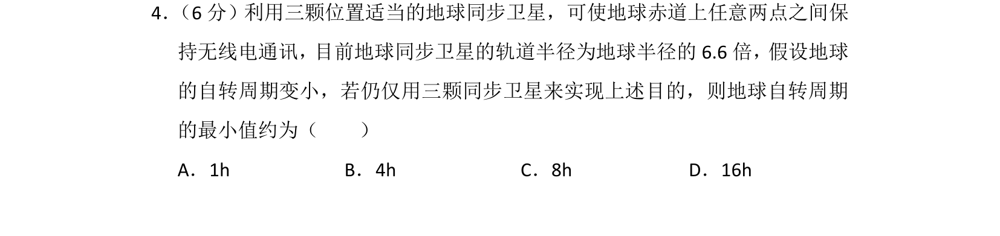
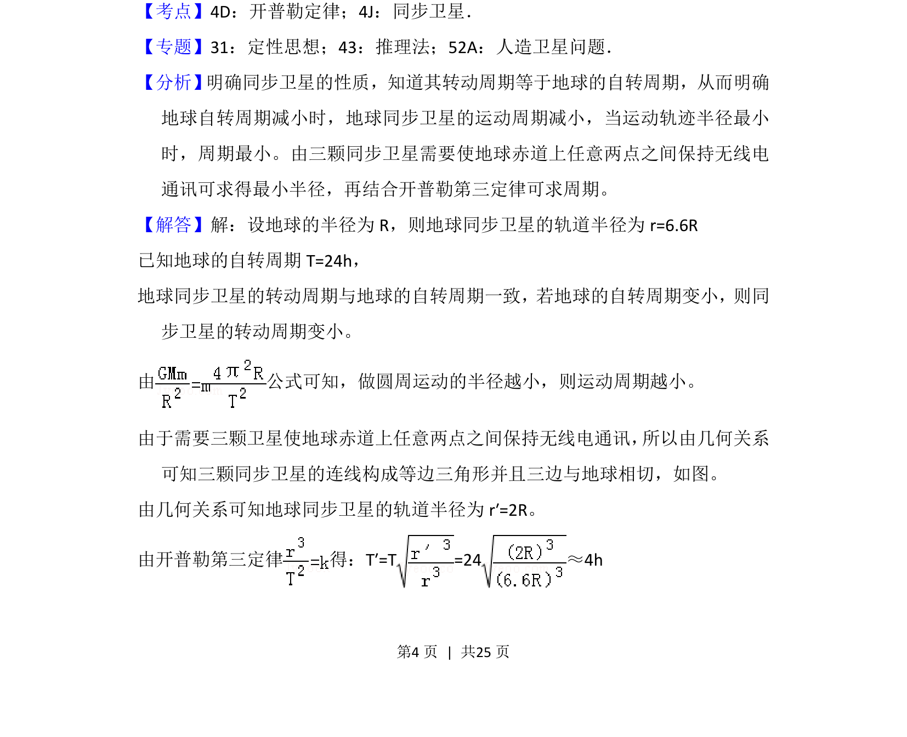
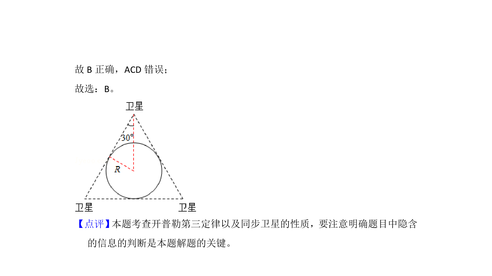

## 题面

## 摘要

通过几何约束与开普勒定律求解地球自转周期最小值

## 关联考点

- [[560-同步卫星|同步卫星]]
- [[266-开普勒第三定律|开普勒第三定律]]
- [[866-轨道半径|轨道半径]]
- [[261-周期|周期]]

## 答案与解析

> 📄 原 PDF 第 4 页：`素材/真题/湖南/2008-2024·（湖南）物理高考真题/2016年高考物理试卷（新课标Ⅰ）（解析卷）.pdf`

<!-- 题干文本-start -->
## 题干文本
4． （6分）利用三颗位置适当的地球同步卫星，可使地球赤道上任意两点之间保
持无线电通讯，目前地球同步卫星的轨道半径为地球半径的6.6倍，假设地球
的自转周期变小，若仍仅用三颗同步卫星来实现上述目的，则地球自转周期
的最小值约为（　　）
A．1h B．4h C．8h D．16h
<!-- 题干文本-end -->

<!-- 解析文本-start -->
## 解析文本
【考点】4D：开普勒定律；4J：同步卫星．菁优网版权所有
【专题】31：定性思想；43：推理法；52A：人造卫星问题．
【分析】 明确同步卫星的性质，知道其转动周期等于地球的自转周期，从而明确
地球自转周期减小时，地球同步卫星的运动周期减小，当运动轨迹半径最小
时，周期最小。由三颗同步卫星需要使地球赤道上任意两点之间保持无线电
通讯可求得最小半径，再结合开普勒第三定律可求周期。
【解答】解：设地球的半径为R，则地球同步卫星的轨道半径为r=6.6R
已知地球的自转周期T=24h，
地球同步卫星的转动周期与地球的自转周期一致，若地球的自转周期变小，则同
步卫星的转动周期变小。
由 公式可知，做圆周运动的半径越小，则运动周期越小。
由于需要三颗卫星使地球赤道上任意两点之间保持无线电通讯， 所以由几何关系
可知三颗同步卫星的连线构成等边三角形并且三边与地球相切，如图。
由几何关系可知地球同步卫星的轨道半径为r′=2R。
由开普勒第三定律 得：T′=T=24≈4h
<!-- 解析文本-end -->
