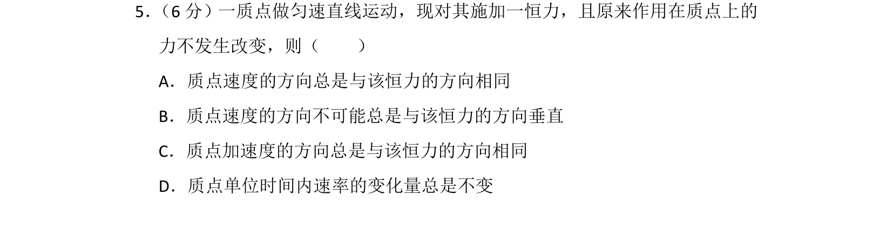
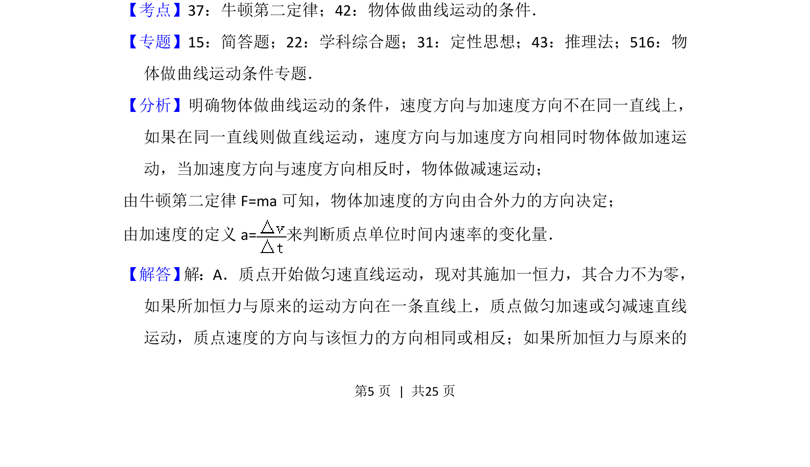
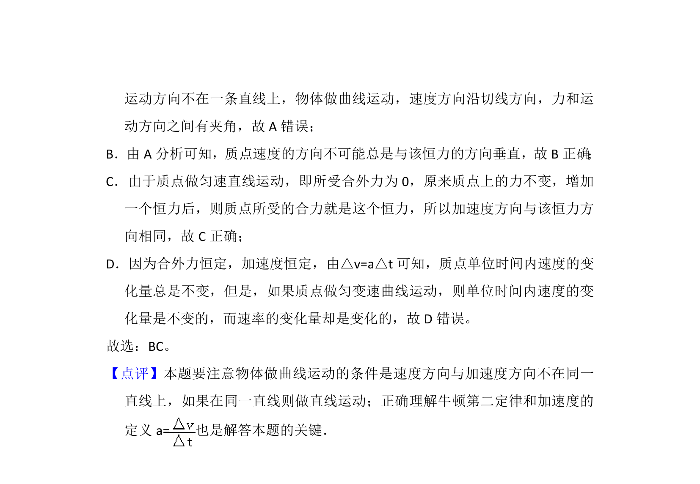

## 题面

## 摘要

质点受恒力作用时速度与加速度方向关系及速率变化判定

## 关联考点

- [[229-牛顿第二定律|牛顿第二定律]]
- [[物体做曲线运动的条件]]

## 答案与解析

> 📄 原 PDF 第 5 页：`素材/真题/湖南/2008-2024·（湖南）物理高考真题/2016年高考物理试卷（新课标Ⅰ）（解析卷）.pdf`

<!-- 题干文本-start -->
## 题干文本
5． （6分）一质点做匀速直线运动，现对其施加一恒力，且原来作用在质点上的
力不发生改变，则（　　）
A．质点速度的方向总是与该恒力的方向相同
B．质点速度的方向不可能总是与该恒力的方向垂直
C．质点加速度的方向总是与该恒力的方向相同
D．质点单位时间内速率的变化量总是不变
<!-- 题干文本-end -->

<!-- 解析文本-start -->
## 解析文本
【考点】37：牛顿第二定律；42：物体做曲线运动的条件．菁优网版权所有
【专题】15：简答题；22：学科综合题；31：定性思想；43：推理法；516：物
体做曲线运动条件专题．
【分析】明确物体做曲线运动的条件，速度方向与加速度方向不在同一直线上，
如果在同一直线则做直线运动，速度方向与加速度方向相同时物体做加速运
动，当加速度方向与速度方向相反时，物体做减速运动；
由牛顿第二定律F=ma可知，物体加速度的方向由合外力的方向决定；
由加速度的定义a=来判断质点单位时间内速率的变化量．
【解答】 解：A．质点开始做匀速直线运动，现对其施加一恒力，其合力不为零，
如果所加恒力与原来的运动方向在一条直线上，质点做匀加速或匀减速直线
运动，质点速度的方向与该恒力的方向相同或相反；如果所加恒力与原来的
<!-- 解析文本-end -->
