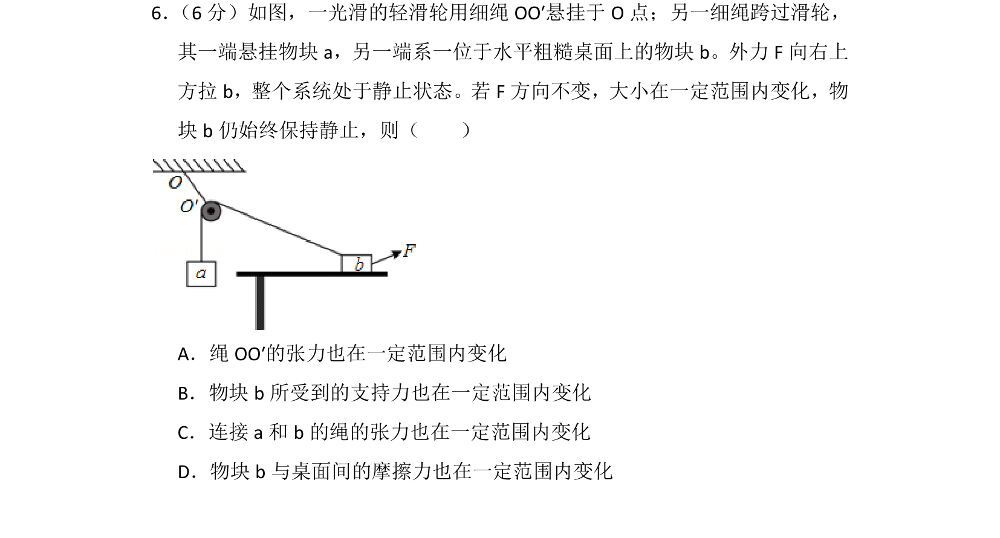
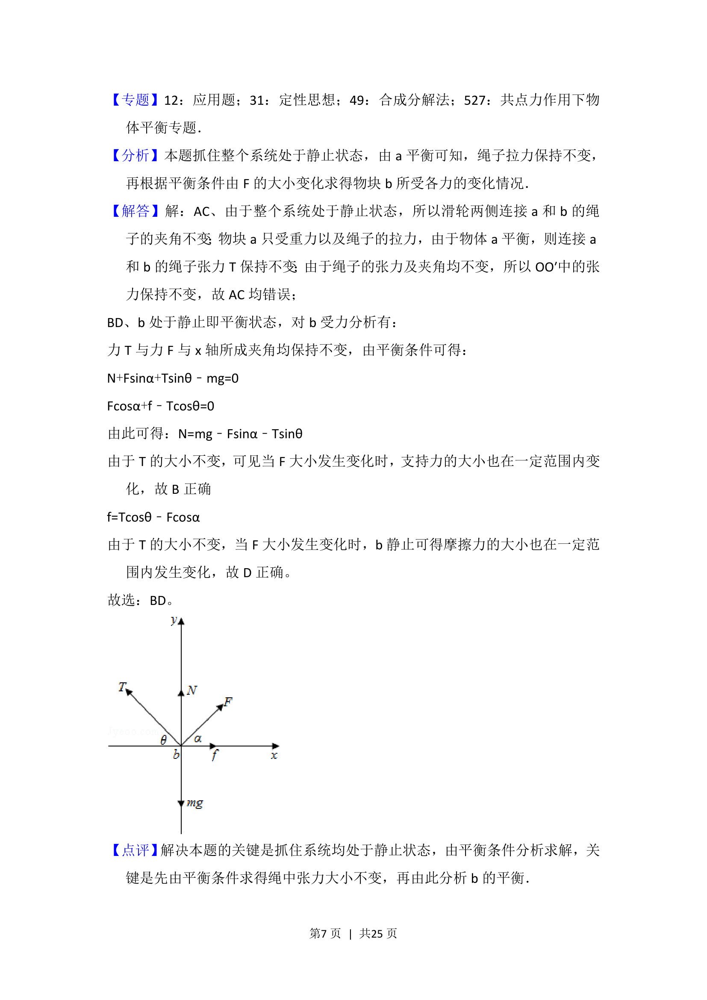

## 题面

## 摘要

考查共点力平衡下动态变化分析，涉及定滑轮、受力分析与摩擦力变化。

## 关联考点

- [[532-力的合成与分解|力的合成与分解]]
- [[208-共点力平衡|共点力的平衡]]

## 答案与解析

> 📄 原 PDF 第 6 页：`素材/真题/湖南/2008-2024·（湖南）物理高考真题/2016年高考物理试卷（新课标Ⅰ）（解析卷）.pdf`

<!-- 题干文本-start -->
## 题干文本
6． （6分）如图，一光滑的轻滑轮用细绳OO′悬挂于O点；另一细绳跨过滑轮，
其一端悬挂物块a，另一端系一位于水平粗糙桌面上的物块b。外力F向右上
方拉b，整个系统处于静止状态。若F方向不变，大小在一定范围内变化，物
块b仍始终保持静止，则（　　）
A．绳OO′的张力也在一定范围内变化
B．物块b所受到的支持力也在一定范围内变化
C．连接a和b的绳的张力也在一定范围内变化
D．物块b与桌面间的摩擦力也在一定范围内变化
<!-- 题干文本-end -->

<!-- 解析文本-start -->
## 解析文本
【考点】2G：力的合成与分解的运用；3C：共点力的平衡．菁优网版权所有
<!-- 解析文本-end -->
