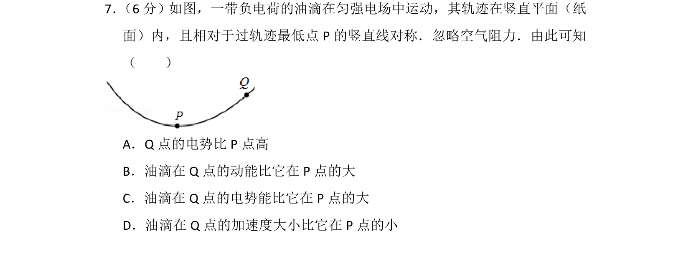
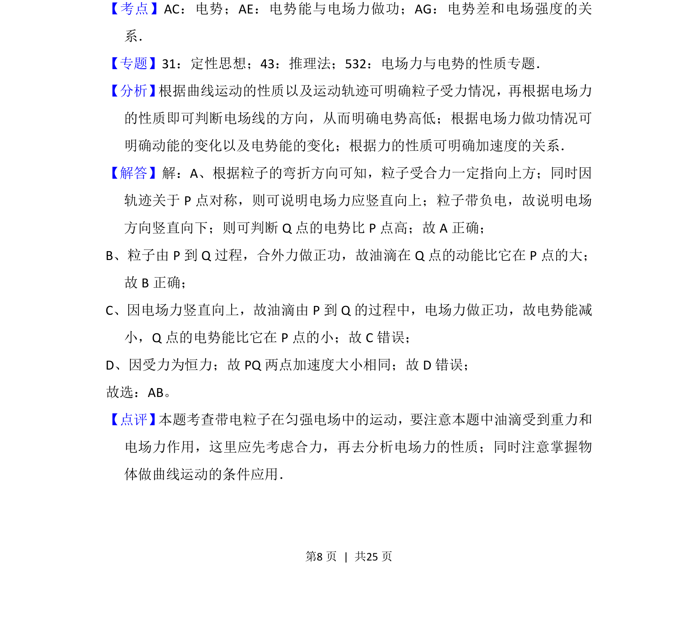

## 题面

## 摘要

带电油滴在匀强电场与重力场中的曲线运动，结合轨迹对称性分析电场方向、电势、动能及电势能变化。

## 关联考点

- [[308-电势|电势]]
- [[电势能与电场力做功]]
- [[251-动能定理|动能定理]]
- [[623-曲线运动条件|曲线运动条件]]

## 答案与解析

> 📄 原 PDF 第 8 页：`素材/真题/湖南/2008-2024·（湖南）物理高考真题/2016年高考物理试卷（新课标Ⅰ）（解析卷）.pdf`
