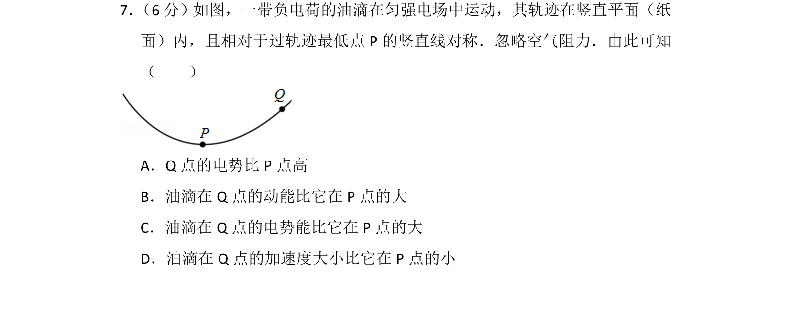
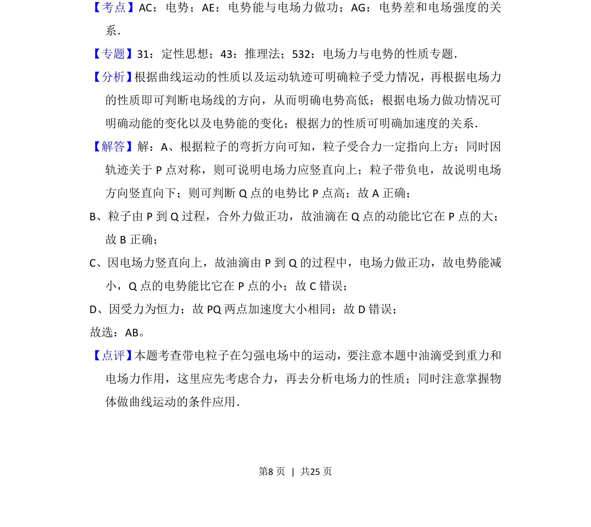

## 题面

## 摘要

带电油滴在匀强电场与重力场中的曲线运动，结合轨迹对称性分析电场方向、电势、动能及电势能变化。

## 关联考点

- [[308-电势|电势]]
- [[电势能与电场力做功]]
- [[251-动能定理|动能定理]]
- [[623-曲线运动条件|曲线运动条件]]

## 答案与解析

> 📄 原 PDF 第 8 页：`素材/真题/湖南/2008-2024·（湖南）物理高考真题/2016年高考物理试卷（新课标Ⅰ）（解析卷）.pdf`

<!-- 题干文本-start -->
## 题干文本
7． （6分）如图，一带负电荷的油滴在匀强电场中运动，其轨迹在竖直平面（纸
面）内，且相对于过轨迹最低点P的竖直线对称．忽略空气阻力．由此可知
（　　）
A．Q点的电势比P点高
B．油滴在Q点的动能比它在P点的大
C．油滴在Q点的电势能比它在P点的大
D．油滴在Q点的加速度大小比它在P点的小
<!-- 题干文本-end -->

<!-- 解析文本-start -->
## 解析文本
【考点】AC：电势；AE：电势能与电场力做功；AG：电势差和电场强度的关
系．菁优网版权所有
【专题】31：定性思想；43：推理法；532：电场力与电势的性质专题．
【分析】 根据曲线运动的性质以及运动轨迹可明确粒子受力情况，再根据电场力
的性质即可判断电场线的方向，从而明确电势高低；根据电场力做功情况可
明确动能的变化以及电势能的变化；根据力的性质可明确加速度的关系．
【解答】解：A、根据粒子的弯折方向可知，粒子受合力一定指向上方；同时因
轨迹关于P点对称，则可说明电场力应竖直向上；粒子带负电，故说明电场
方向竖直向下；则可判断Q点的电势比P点高；故A正确；
B、粒子由P到Q过程，合外力做正功，故油滴在Q点的动能比它在P点的大；
故B正确；
C、因电场力竖直向上，故油滴由P到Q的过程中，电场力做正功，故电势能减
小，Q点的电势能比它在P点的小；故C错误；
D、因受力为恒力；故PQ两点加速度大小相同；故D错误；
故选：AB。
【点评】 本题考查带电粒子在匀强电场中的运动，要注意本题中油滴受到重力和
电场力作用，这里应先考虑合力，再去分析电场力的性质；同时注意掌握物
体做曲线运动的条件应用．
<!-- 解析文本-end -->
