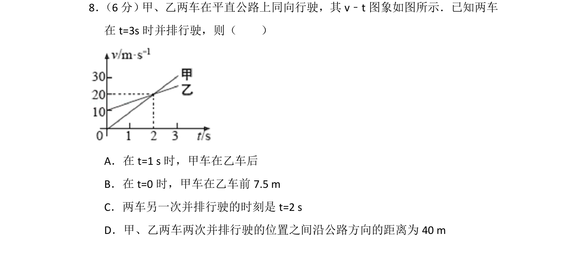
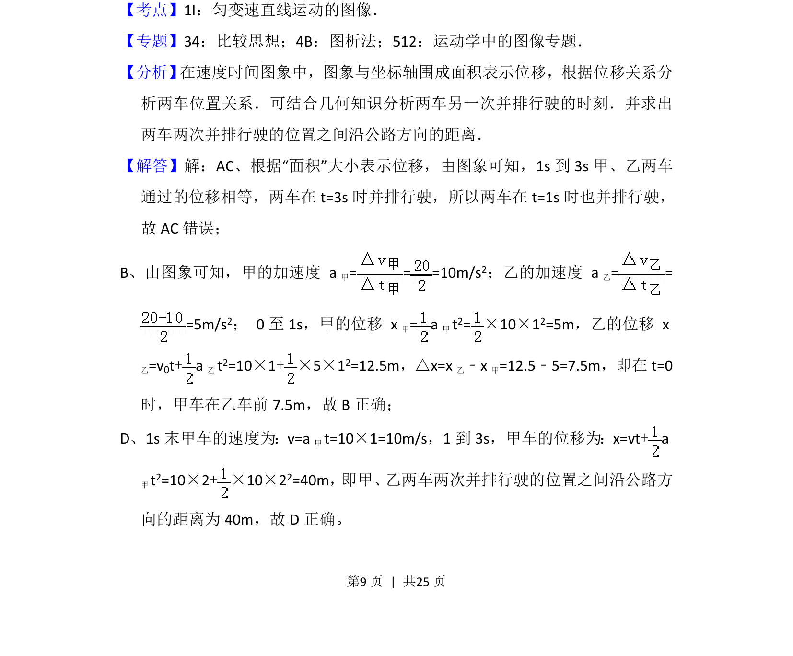
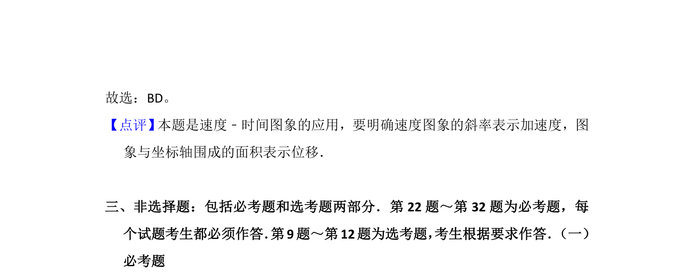

## 题面

## 摘要

甲、乙两车v-t图象与追及并排行驶问题，利用图象面积分析位移关系，计算初始车距和两次并排间距。

## 关联考点

- [[匀变速直线运动的图像]]
- [[822-追及相遇问题|追及问题]]
- [[v-t图象面积]]
- [[位移计算]]

## 答案与解析

> 📄 原 PDF 第 9 页：`素材/真题/湖南/2008-2024·（湖南）物理高考真题/2016年高考物理试卷（新课标Ⅰ）（解析卷）.pdf`
