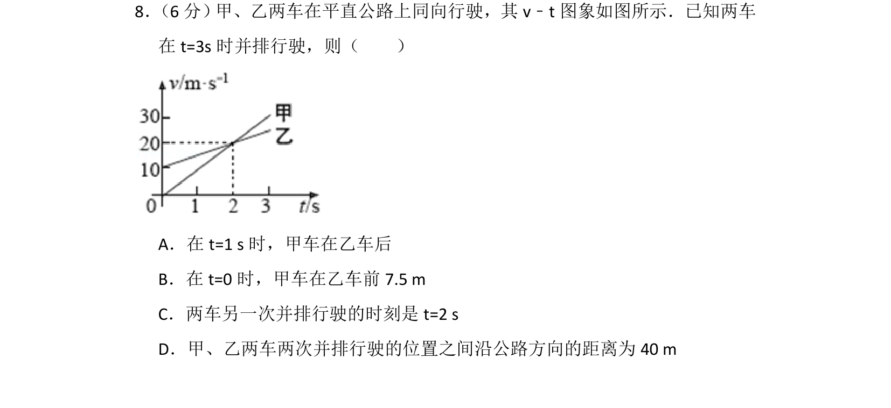
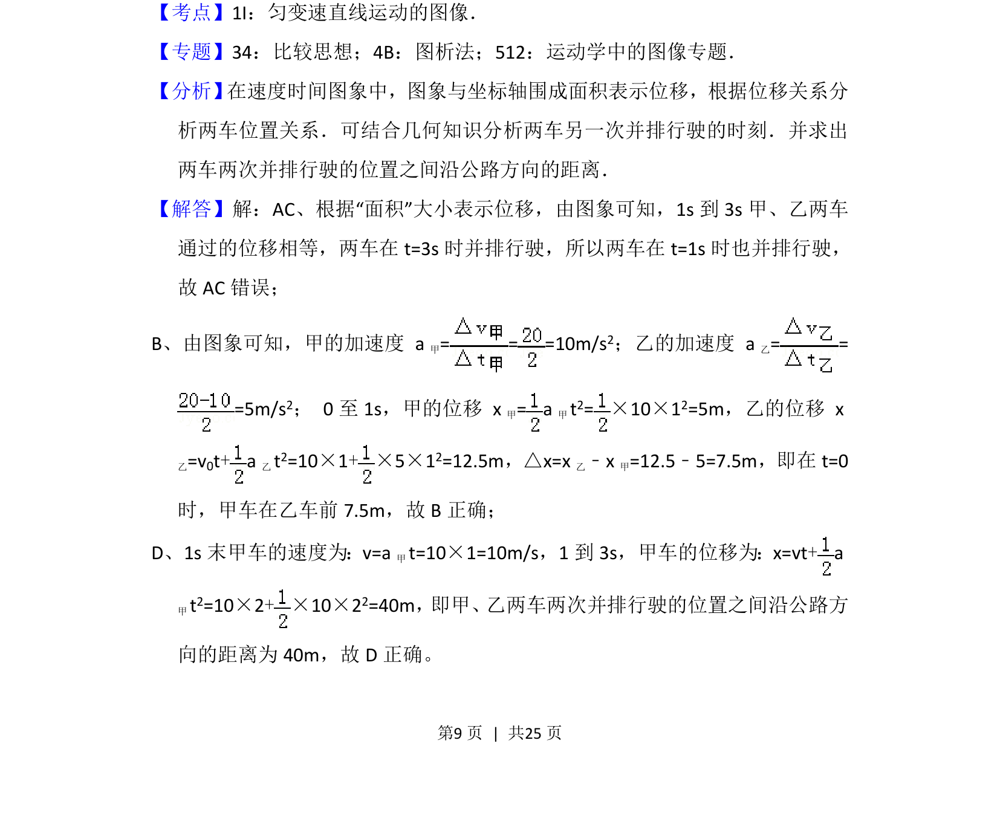
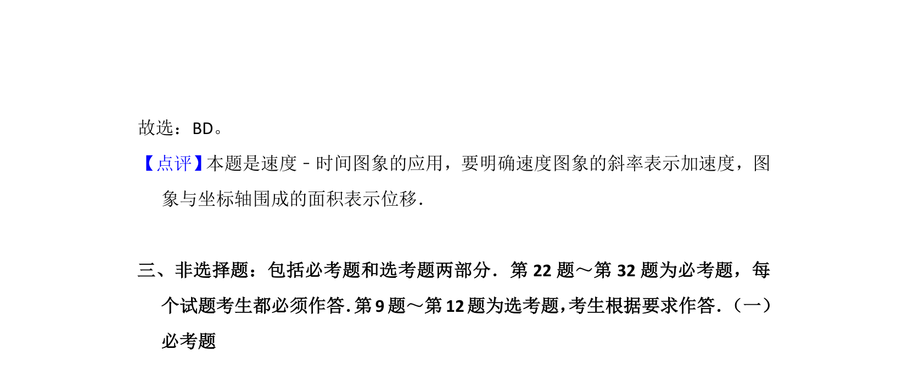

## 题面

## 摘要

甲、乙两车v-t图象与追及并排行驶问题，利用图象面积分析位移关系，计算初始车距和两次并排间距。

## 关联考点

- [[匀变速直线运动的图像]]
- [[822-追及相遇问题|追及问题]]
- [[v-t图象面积]]
- [[位移计算]]

## 答案与解析

> 📄 原 PDF 第 9 页：`素材/真题/湖南/2008-2024·（湖南）物理高考真题/2016年高考物理试卷（新课标Ⅰ）（解析卷）.pdf`

<!-- 题干文本-start -->
## 题干文本
8． （6分） 甲、乙两车在平直公路上同向行驶，其v﹣t图象如图所示．已知两车
在t=3s时并排行驶，则（　　）
A．在t=1 s时，甲车在乙车后
B．在t=0时，甲车在乙车前7.5 m
C．两车另一次并排行驶的时刻是t=2 s
D．甲、乙两车两次并排行驶的位置之间沿公路方向的距离为40 m
<!-- 题干文本-end -->

<!-- 解析文本-start -->
## 解析文本
【考点】1I：匀变速直线运动的图像．菁优网版权所有
【专题】34：比较思想；4B：图析法；512：运动学中的图像专题．
【分析】 在速度时间图象中，图象与坐标轴围成面积表示位移，根据位移关系分
析两车位置关系．可结合几何知识分析两车另一次并排行驶的时刻．并求出
两车两次并排行驶的位置之间沿公路方向的距离．
【解答】解：AC、根据“面积”大小表示位移，由图象可知，1s到3s甲、乙两车
通过的位移相等，两车在t=3s时并排行驶，所以两车在t=1s时也并排行驶，
故AC错误；
B、由图象可知，甲的加速度 a 甲= = =10m/s 2；乙的加速度 a 乙= =
=5m/s2； 0至1s，甲的位移 x 甲= a 甲 t2=×10×1 2=5m，乙的位移 x
乙=v0t+a 乙 t2=10×1+ ×5×1 2=12.5m，△x=x 乙﹣x 甲=12.5﹣5=7.5m，即在t=0
时，甲车在乙车前7.5m，故B正确；
D、1s末甲车的速度为：v=a 甲 t=10×1=10m/s，1到3s，甲车的位移为：x=vt+a
甲 t2=10×2+ ×10×2 2=40m， 即甲、 乙两车两次并排行驶的位置之间沿公路方
向的距离为40m，故D正确。
<!-- 解析文本-end -->
