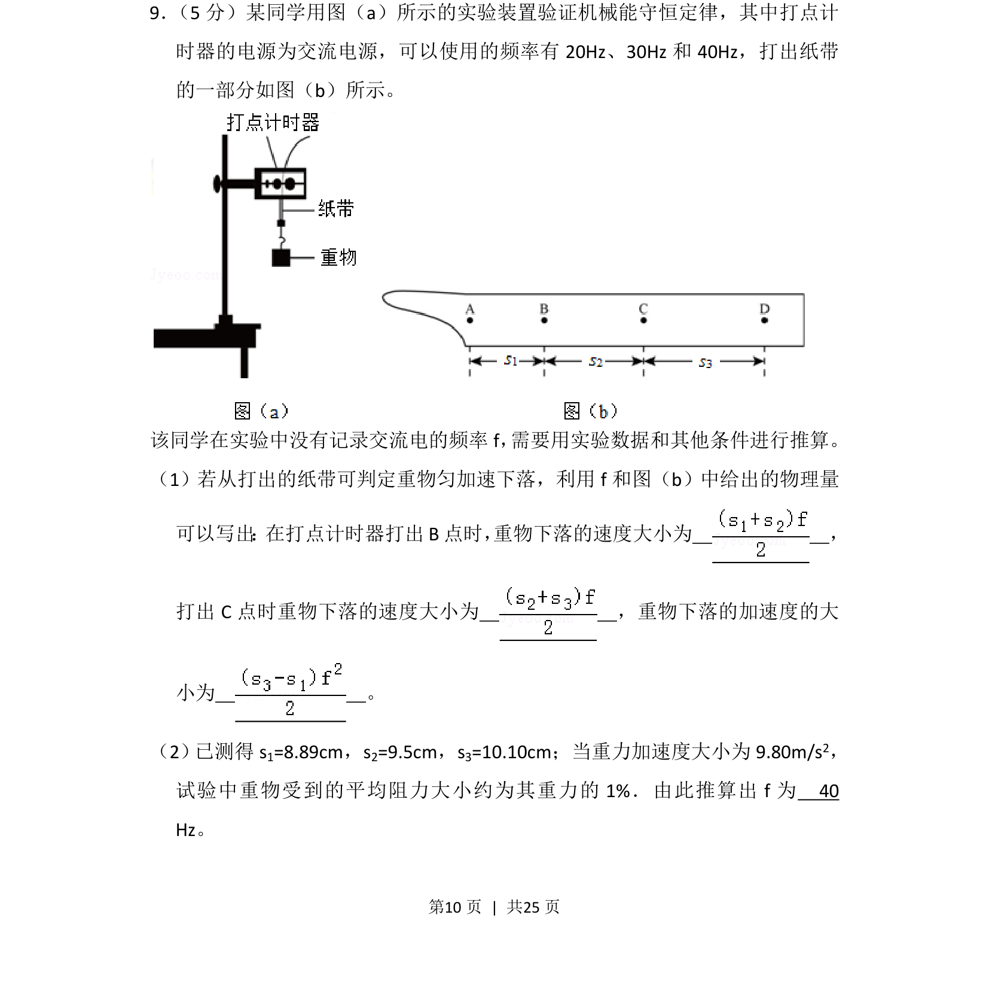
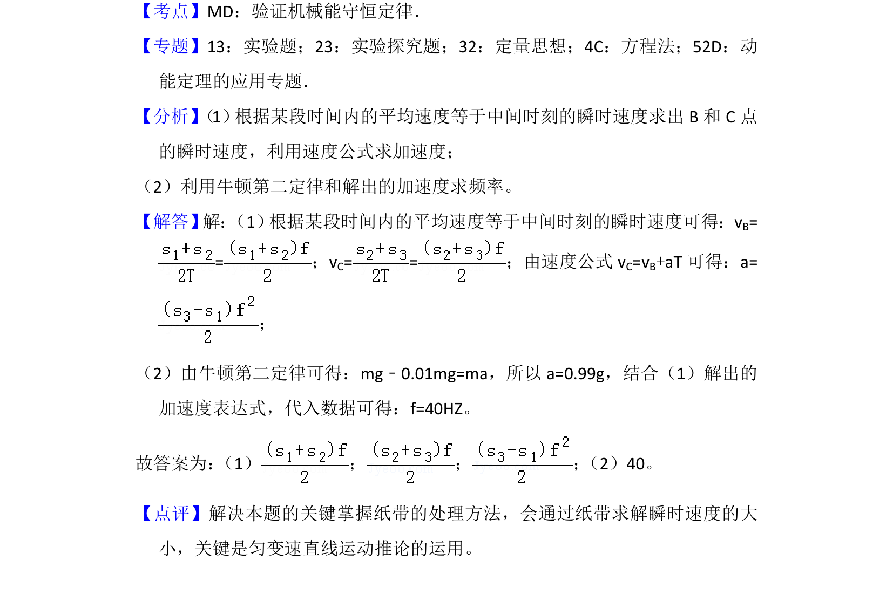

## 题面

## 摘要

验证机械能守恒定律实验中，利用纸带数据推算重物速度与加速度，并结合阻力推算交流电频率。

## 关联考点

- [[085-机械能守恒-初中|机械能守恒定律]]
- [[打点计时器纸带分析]]
- [[匀变速运动规律]]
- [[582-实验数据处理|实验数据处理]]

## 答案与解析

> 📄 原 PDF 第 10 页：`素材/真题/湖南/2008-2024·（湖南）物理高考真题/2016年高考物理试卷（新课标Ⅰ）（解析卷）.pdf`
