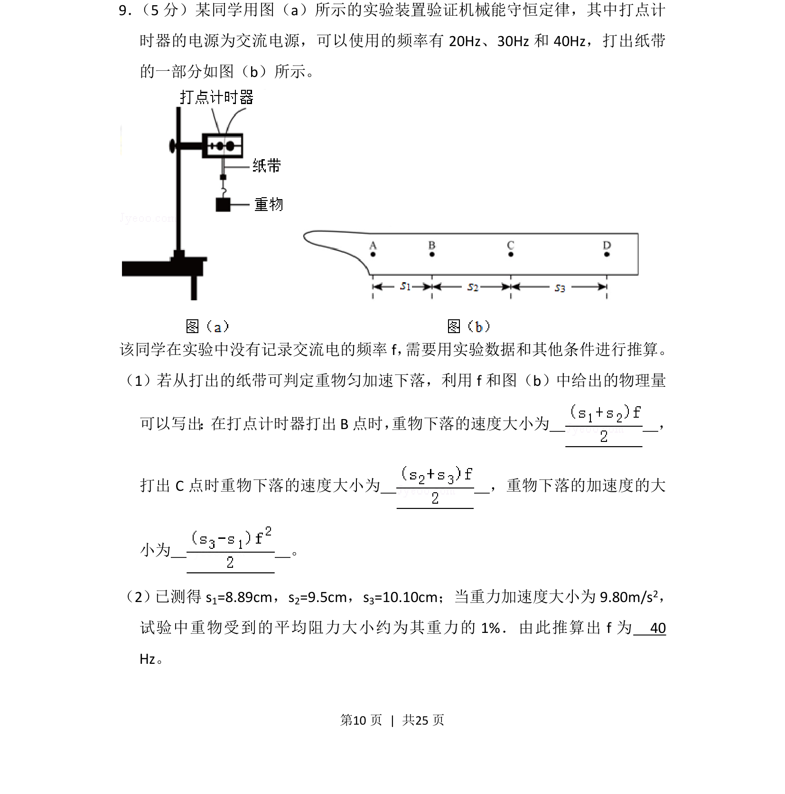
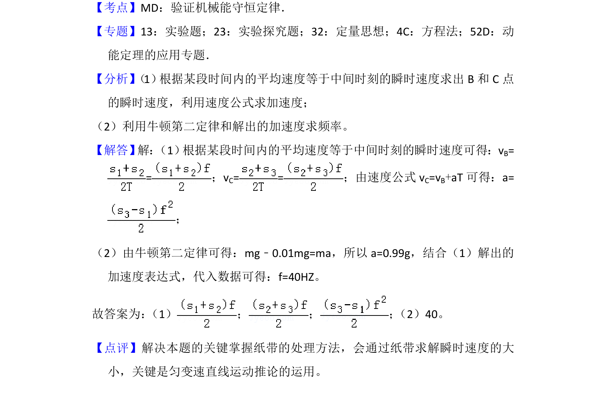

## 题面

## 摘要

验证机械能守恒定律实验中，利用纸带数据推算重物速度与加速度，并结合阻力推算交流电频率。

## 关联考点

- [[085-机械能守恒-初中|机械能守恒定律]]
- [[打点计时器纸带分析]]
- [[匀变速运动规律]]
- [[582-实验数据处理|实验数据处理]]

## 答案与解析

> 📄 原 PDF 第 10 页：`素材/真题/湖南/2008-2024·（湖南）物理高考真题/2016年高考物理试卷（新课标Ⅰ）（解析卷）.pdf`

<!-- 题干文本-start -->
## 题干文本
9． （5分）某同学用图（a）所示的实验装置验证机械能守恒定律，其中打点计
时器的电源为交流电源，可以使用的频率有20Hz、30Hz和40Hz，打出纸带
的一部分如图（b）所示。   
该同学在实验中没有记录交流电的频率f， 需要用实验数据和其他条件进行推算。
（1）若从打出的纸带可判定重物匀加速下落，利用f和图（b）中给出的物理量
可以写出 ： 在打点计时器打出B点时， 重物下落的速度大小为　 　，
打出C点时重物下落的速度大小为　 　，重物下落的加速度的大
小为　 　。
（2） 已测得s1=8.89cm，s2=9.5cm，s3=10.10cm；当重力加速度大小为9.80m/s 2，
试验中重物受到的平均阻力大小约为其重力的1%．由此推算出f为　40　
Hz。
<!-- 题干文本-end -->

<!-- 解析文本-start -->
## 解析文本

<!-- 解析文本-end -->
