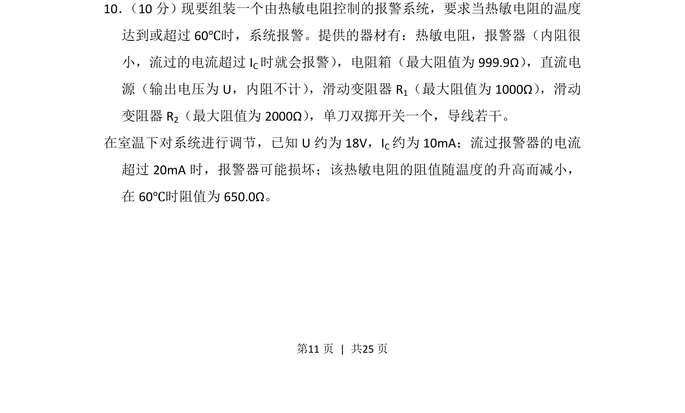
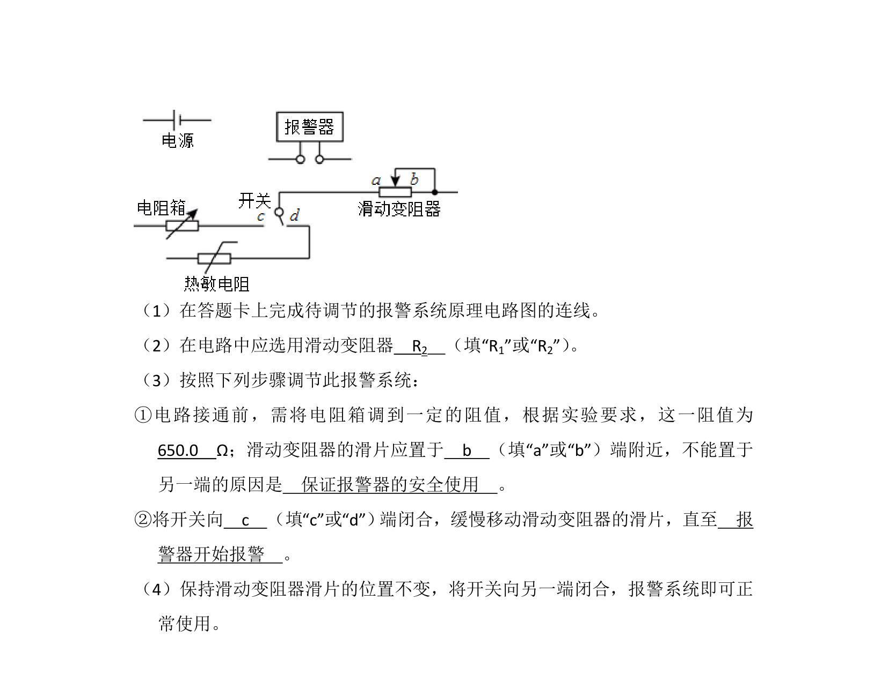
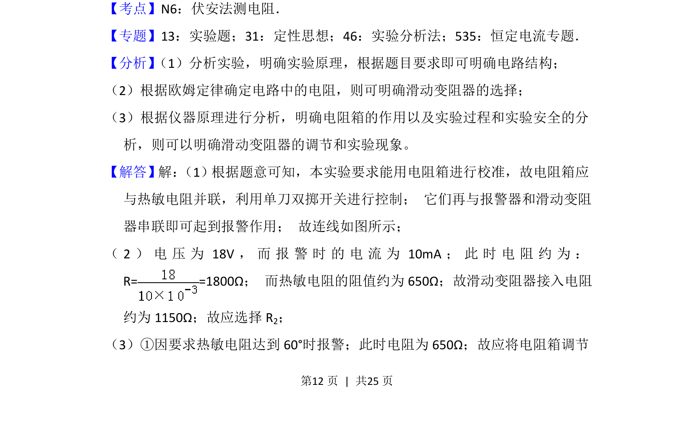
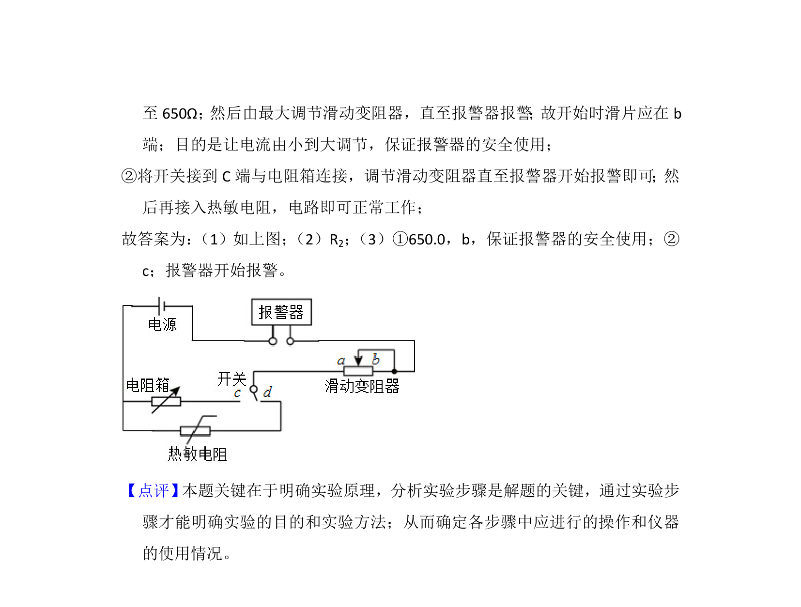

## 题面

## 摘要

组装热敏电阻报警系统，考查电路设计与参数调节以控制报警温度阈值。

## 关联考点

- [[传感器应用]]
- [[332-闭合电路欧姆定律|闭合电路欧姆定律]]
- [[滑动变阻器分压限流]]
- [[817-电学实验|电学实验]]

## 答案与解析

> 📄 原 PDF 第 11 页：`素材/真题/湖南/2008-2024·（湖南）物理高考真题/2016年高考物理试卷（新课标Ⅰ）（解析卷）.pdf`
