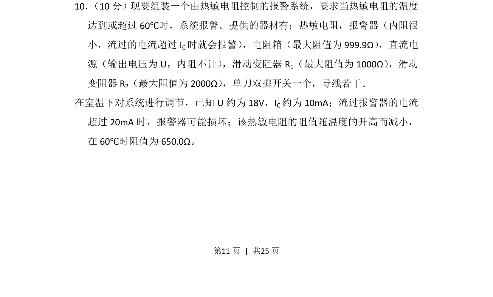
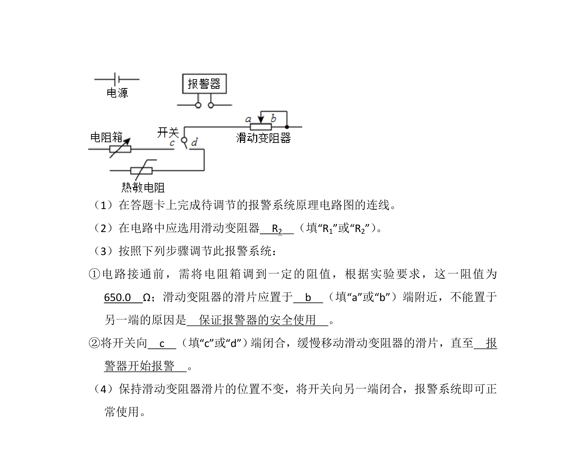
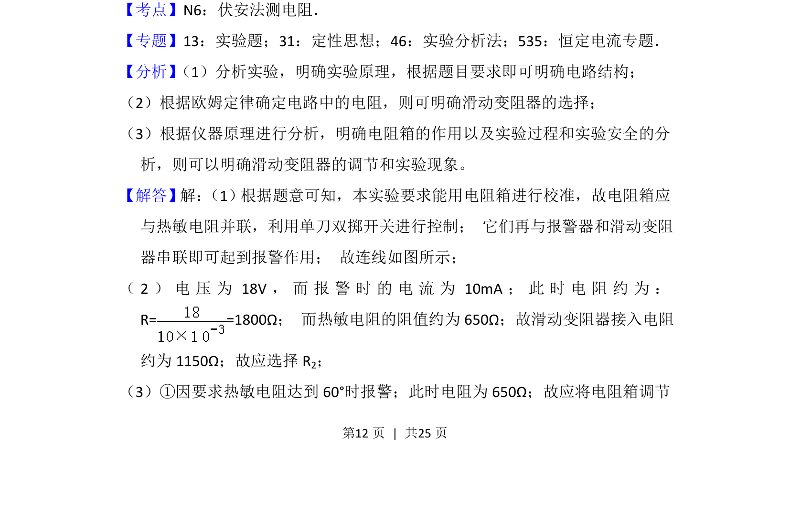
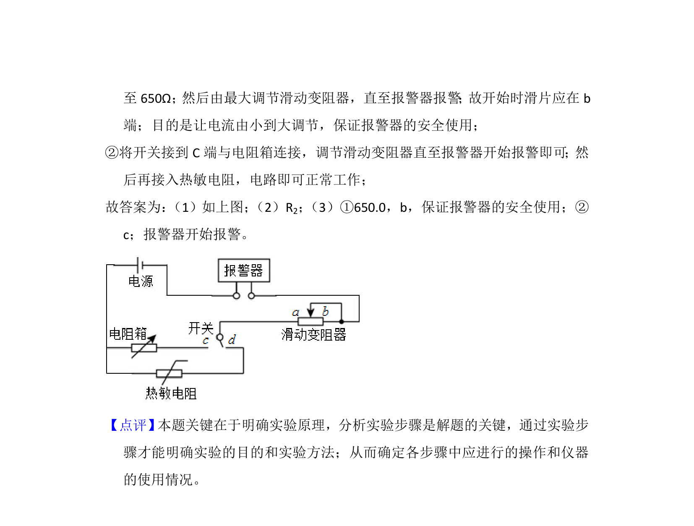

## 题面

## 摘要

组装热敏电阻报警系统，考查电路设计与参数调节以控制报警温度阈值。

## 关联考点

- [[860-传感器应用|传感器应用]]
- [[332-闭合电路欧姆定律|闭合电路欧姆定律]]
- [[滑动变阻器分压限流]]
- [[817-电学实验|电学实验]]

## 答案与解析

> 📄 原 PDF 第 11 页：`素材/真题/湖南/2008-2024·（湖南）物理高考真题/2016年高考物理试卷（新课标Ⅰ）（解析卷）.pdf`

<!-- 题干文本-start -->
## 题干文本
10． （10分）现要组装一个由热敏电阻控制的报警系统，要求当热敏电阻的温度
达到或超过60℃时，系统报警。提供的器材有：热敏电阻，报警器（内阻很
小，流过的电流超过I C时就会报警） ，电阻箱（最大阻值为999.9Ω） ，直流电
源（输出电压为U，内阻不计） ，滑动变阻器R1（最大阻值为1000Ω） ，滑动
变阻器R 2（最大阻值为2000Ω） ，单刀双掷开关一个，导线若干。
在室温下对系统进行调节，已知U约为18V，I C约为10mA；流过报警器的电流
超过20mA时，报警器可能损坏；该热敏电阻的阻值随温度的升高而减小，
在60℃时阻值为650.0Ω。
<!-- 题干文本-end -->

<!-- 解析文本-start -->
## 解析文本

<!-- 解析文本-end -->
