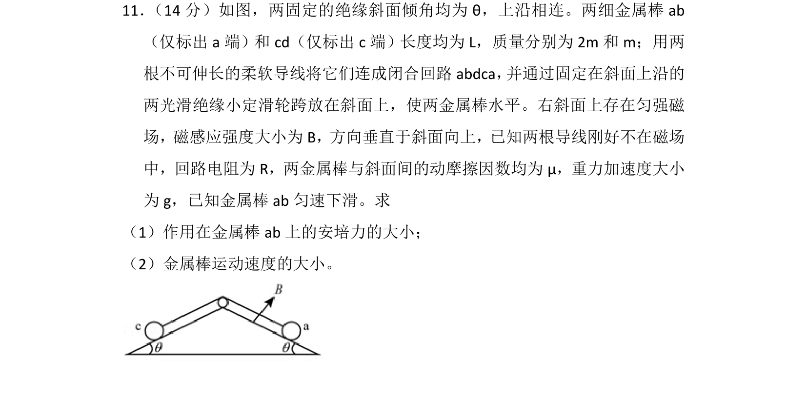
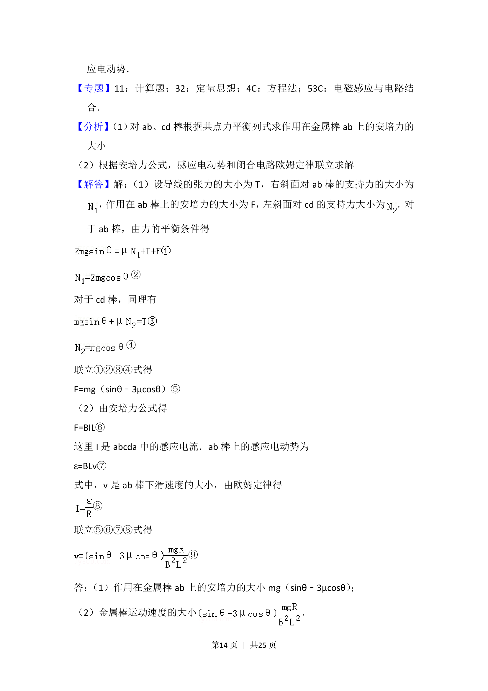

## 题面

## 摘要

两金属棒在斜面上通过导线连接，涉及匀强磁场中导体棒匀速下滑时的安培力与速度求解。

## 关联考点

- [[746-闭合电路的欧姆定律|闭合电路的欧姆定律]]
- [[188-磁场对通电导体的作用|安培力]]
- [[590-导体切割磁感线时的感应电动势|导体切割磁感线时的感应电动势]]

## 答案与解析

> 📄 原 PDF 第 13 页：`素材/真题/湖南/2008-2024·（湖南）物理高考真题/2016年高考物理试卷（新课标Ⅰ）（解析卷）.pdf`
