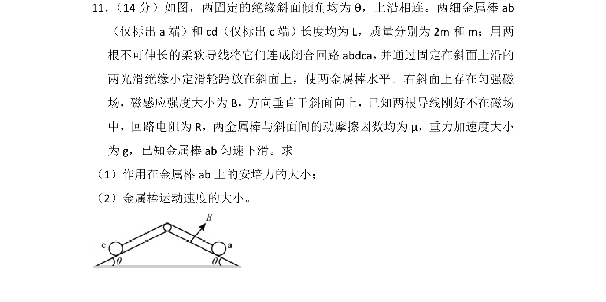
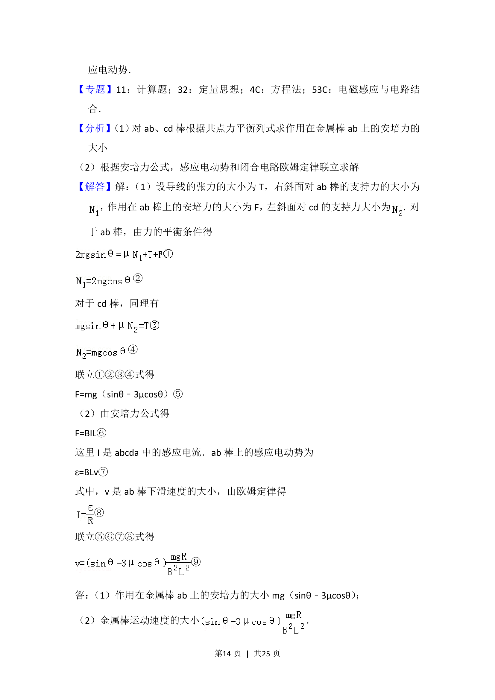

## 题面

## 摘要

两金属棒在斜面上通过导线连接，涉及匀强磁场中导体棒匀速下滑时的安培力与速度求解。

## 关联考点

- [[332-闭合电路欧姆定律|闭合电路的欧姆定律]]
- [[188-磁场对通电导体的作用|安培力]]
- [[590-导体切割磁感线时的感应电动势|导体切割磁感线时的感应电动势]]

## 答案与解析

> 📄 原 PDF 第 13 页：`素材/真题/湖南/2008-2024·（湖南）物理高考真题/2016年高考物理试卷（新课标Ⅰ）（解析卷）.pdf`

<!-- 题干文本-start -->
## 题干文本
11． （14分）如图，两固定的绝缘斜面倾角均为θ，上沿相连。两细金属棒ab
（仅标出a端）和cd（仅标出c端）长度均为L，质量分别为2m和m；用两
根不可伸长的柔软导线将它们连成闭合回路abdca， 并通过固定在斜面上沿的
两光滑绝缘小定滑轮跨放在斜面上，使两金属棒水平。右斜面上存在匀强磁
场，磁感应强度大小为B，方向垂直于斜面向上，已知两根导线刚好不在磁场
中，回路电阻为R，两金属棒与斜面间的动摩擦因数均为μ，重力加速度大小
为g，已知金属棒ab匀速下滑。求
（1）作用在金属棒ab上的安培力的大小；
（2）金属棒运动速度的大小。
<!-- 题干文本-end -->

<!-- 解析文本-start -->
## 解析文本
【考点】BB：闭合电路的欧姆定律；CC：安培力；D9：导体切割磁感线时的感
<!-- 解析文本-end -->
