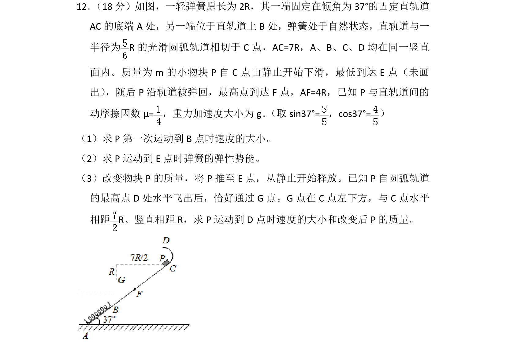
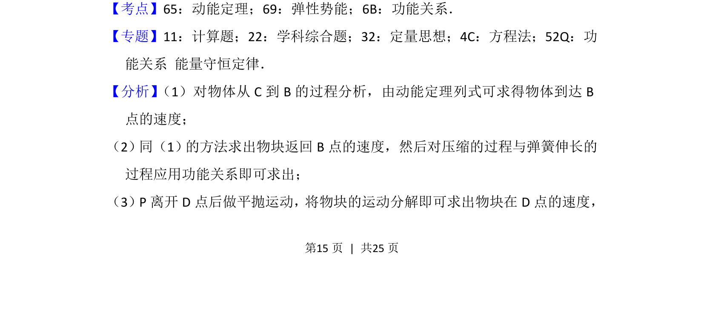
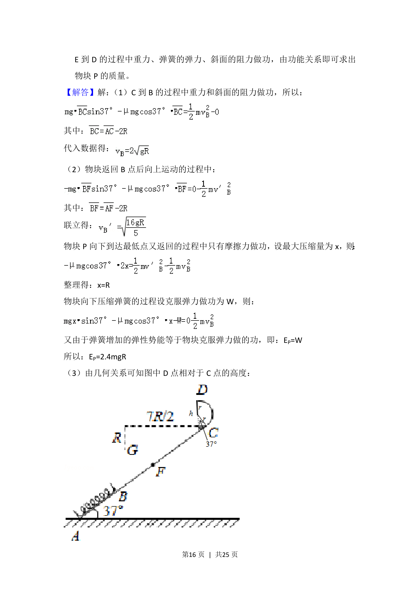
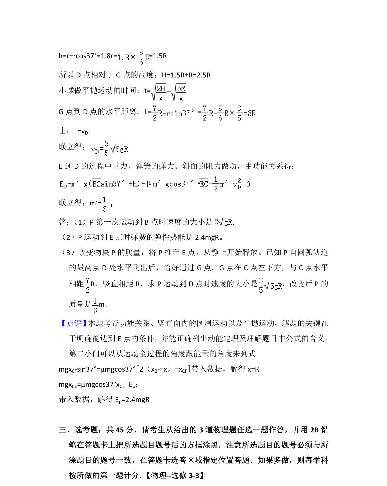

## 题面

## 摘要

物块在粗糙斜面与弹簧系统中先下滑压缩弹簧再反弹，结合平抛运动求速度、弹性势能及质量。

## 关联考点

- [[251-动能定理|动能定理]]
- [[079-弹性势能|弹性势能]]
- [[249-功能关系|功能关系]]
- [[261-平抛运动|平抛运动]]

## 答案与解析

> 📄 原 PDF 第 15 页：`素材/真题/湖南/2008-2024·（湖南）物理高考真题/2016年高考物理试卷（新课标Ⅰ）（解析卷）.pdf`
