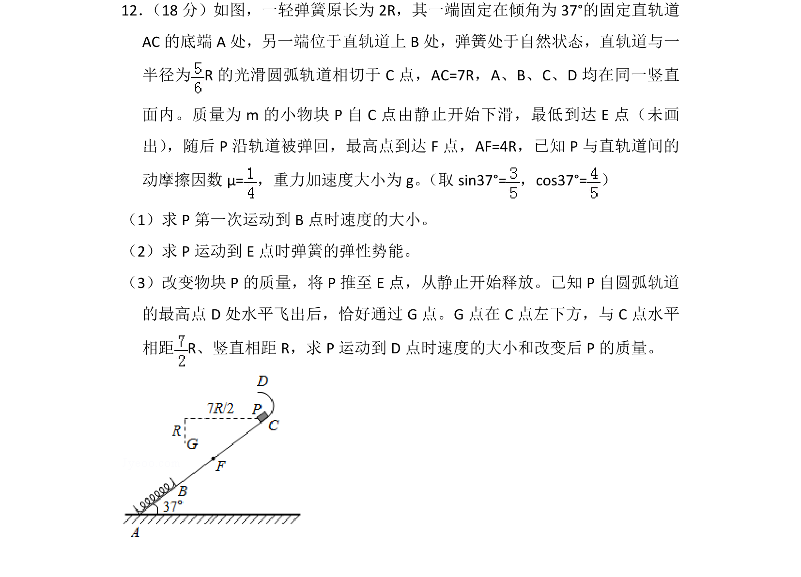
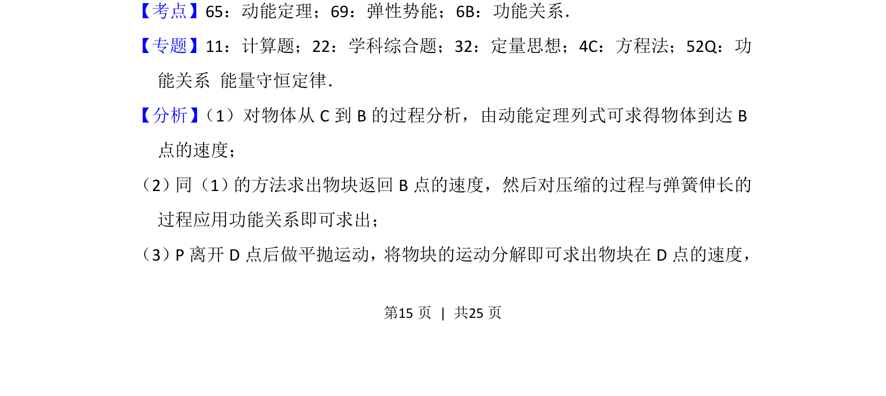
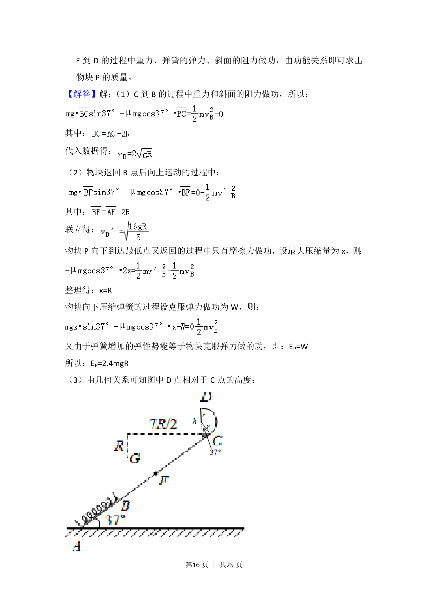
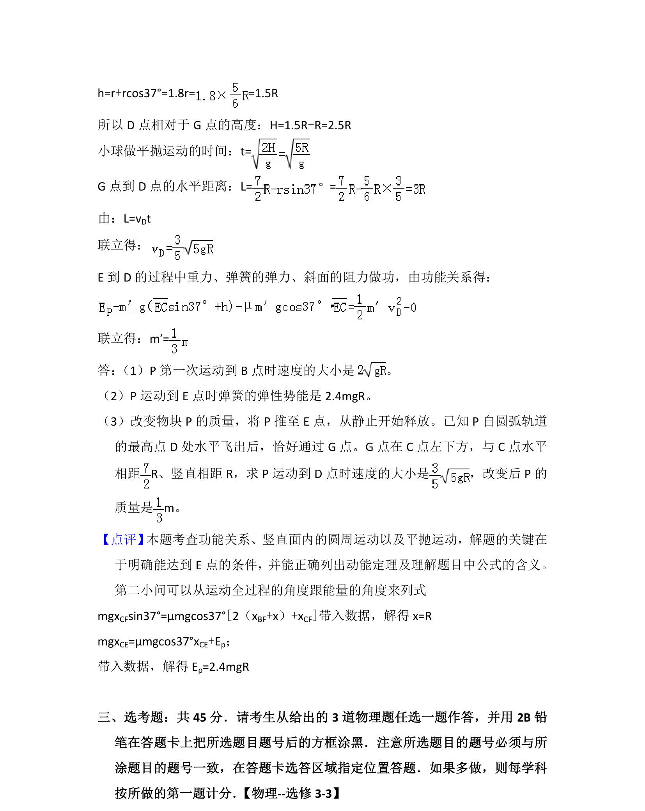

## 题面

## 摘要

物块在粗糙斜面与弹簧系统中先下滑压缩弹簧再反弹，结合平抛运动求速度、弹性势能及质量。

## 关联考点

- [[251-动能定理|动能定理]]
- [[079-弹性势能|弹性势能]]
- [[249-功能关系|功能关系]]
- [[261-平抛运动|平抛运动]]

## 答案与解析

> 📄 原 PDF 第 15 页：`素材/真题/湖南/2008-2024·（湖南）物理高考真题/2016年高考物理试卷（新课标Ⅰ）（解析卷）.pdf`

<!-- 题干文本-start -->
## 题干文本
12． （18分）如图，一轻弹簧原长为2R，其一端固定在倾角为37°的固定直轨道
AC的底端A处，另一端位于直轨道上B处，弹簧处于自然状态，直轨道与一
半径为R的光滑圆弧轨道相切于C点，AC=7R，A、B、C、D均在同一竖直
面内。质量为m的小物块P自C点由静止开始下滑，最低到达E点（未画
出） ，随后P沿轨道被弹回，最高点到达F点，AF=4R，已知P与直轨道间的
动摩擦因数μ=，重力加速度大小为g。 （取sin37°=，cos37°=）
（1）求P第一次运动到B点时速度的大小。
（2）求P运动到E点时弹簧的弹性势能。
（3）改变物块P的质量，将P推至E点，从静止开始释放。已知P自圆弧轨道
的最高点D处水平飞出后，恰好通过G点。G点在C点左下方，与C点水平
相距R、竖直相距R，求P运动到D点时速度的大小和改变后P的质量。
<!-- 题干文本-end -->

<!-- 解析文本-start -->
## 解析文本
【考点】65：动能定理；69：弹性势能；6B：功能关系．菁优网版权所有
【专题】11：计算题；22：学科综合题；32：定量思想；4C：方程法；52Q：功
能关系 能量守恒定律．
【分析】 （1）对物体从C到B的过程分析，由动能定理列式可求得物体到达B
点的速度；
（2）同（1）的方法求出物块返回B点的速度，然后对压缩的过程与弹簧伸长的
过程应用功能关系即可求出；
（3）P离开D点后做平抛运动，将物块的运动分解即可求出物块在D点的速度，
<!-- 解析文本-end -->
