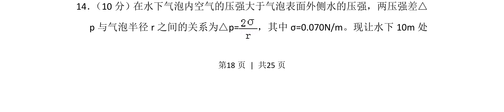
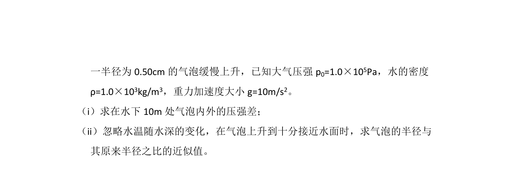
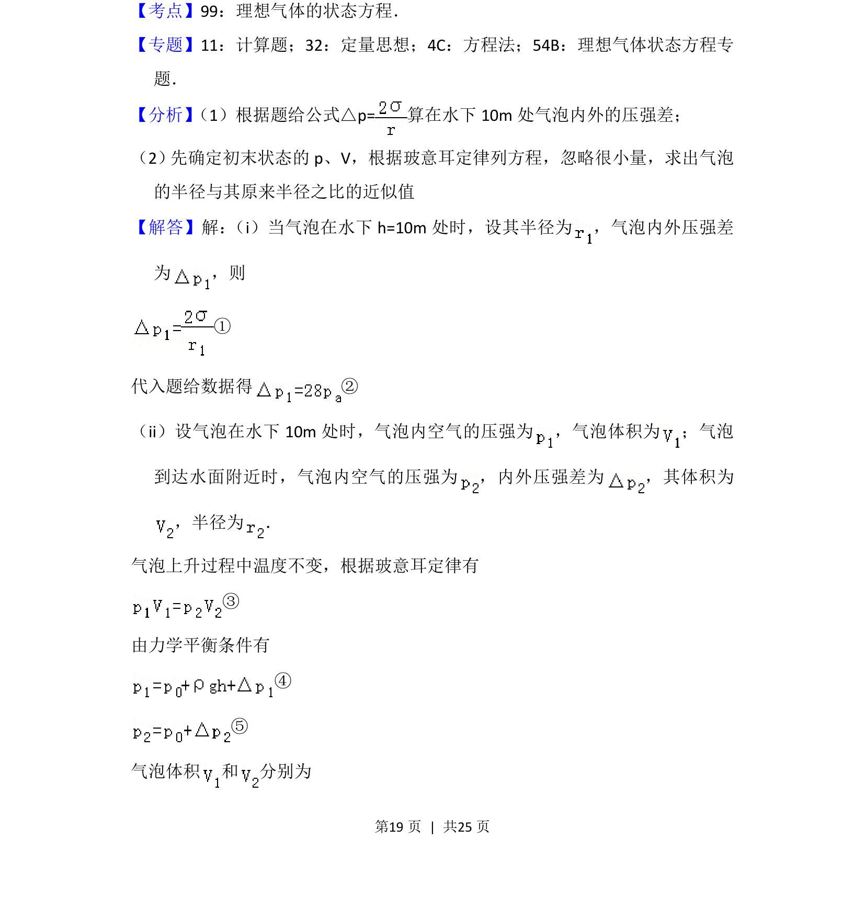
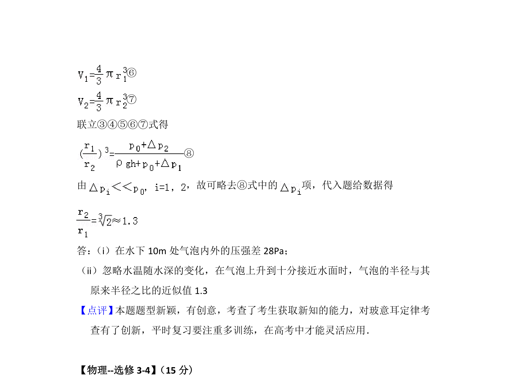

## 题面

## 摘要

气泡内压强与外侧水压的差值关系，结合液体压强计算气泡内气体体积随深度变化。

## 关联考点

- [[096-液体压强|液体压强]]
- [[压强差]]
- [[446-理想气体状态方程|理想气体状态方程]]

## 答案与解析

> 📄 原 PDF 第 18 页：`素材/真题/湖南/2008-2024·（湖南）物理高考真题/2016年高考物理试卷（新课标Ⅰ）（解析卷）.pdf`
