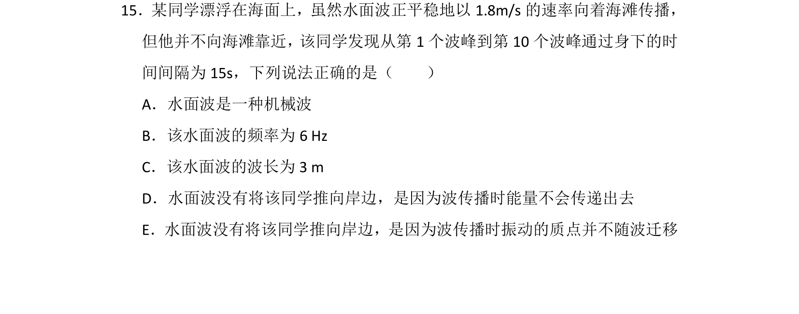
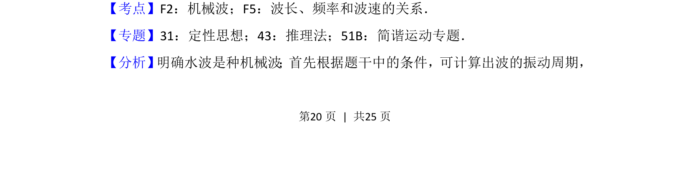
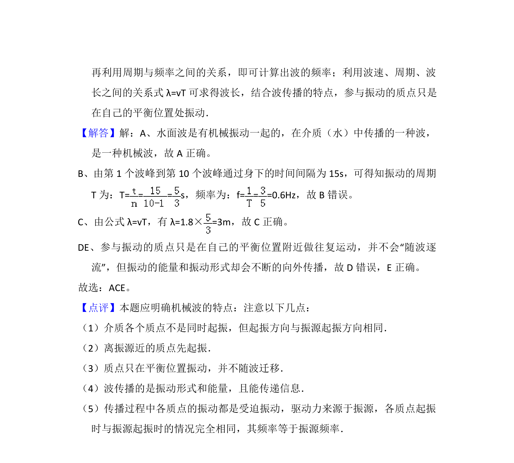

## 题面

## 摘要

考查水波作为机械波的传播特性，涉及波速、波长、频率计算及质点振动与波传播的区别

## 关联考点

- [[362-机械波|机械波]]
- [[370-波长|波长]]
- [[143-频数分布|频率]]
- [[波速关系]]
- [[质点振动与波迁移]]

## 答案与解析

> 📄 原 PDF 第 20 页：`素材/真题/湖南/2008-2024·（湖南）物理高考真题/2016年高考物理试卷（新课标Ⅰ）（解析卷）.pdf`
