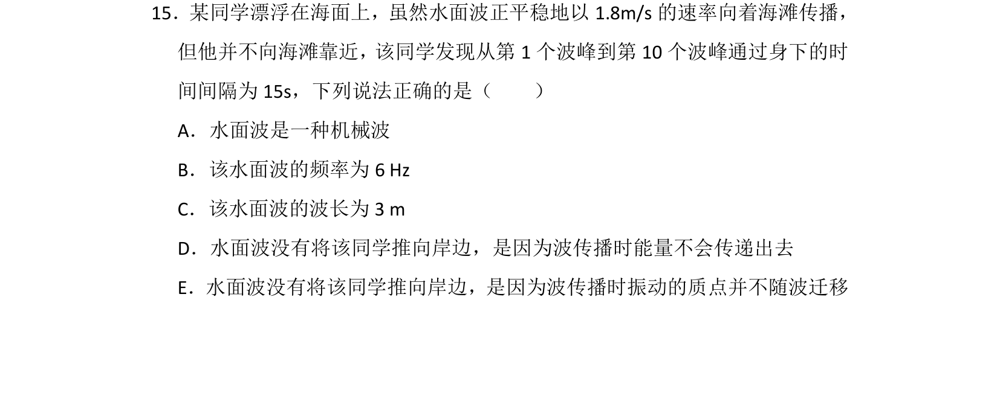
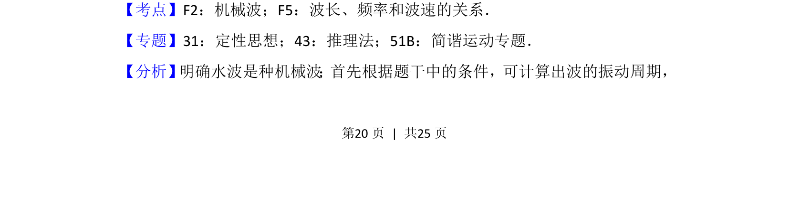
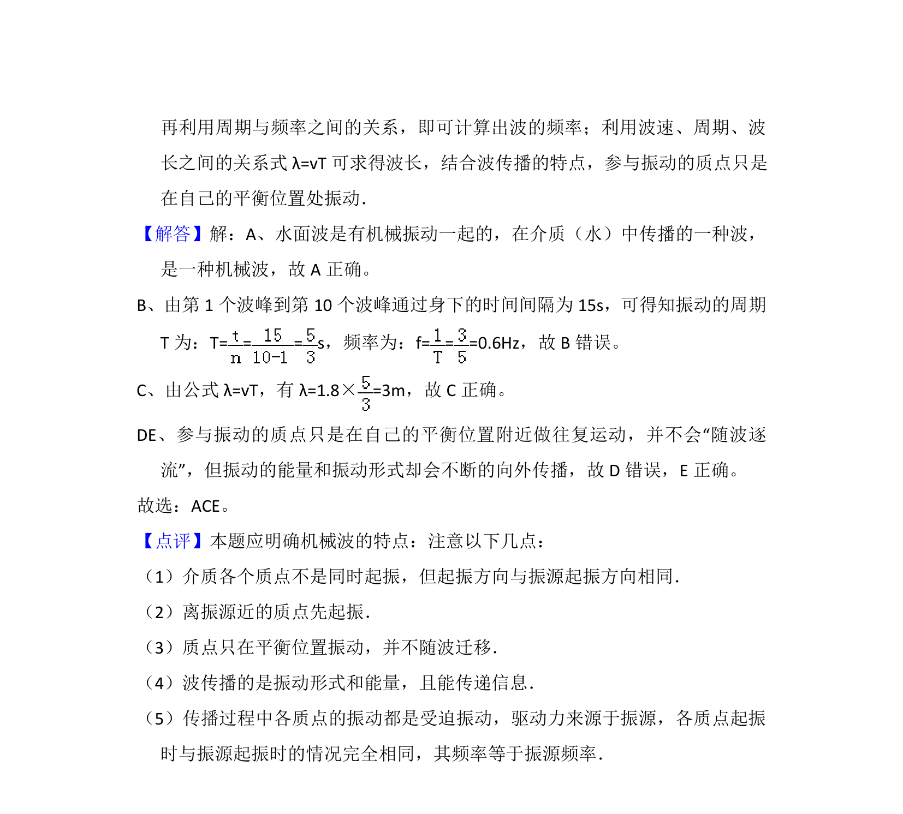

## 题面

## 摘要

考查水波作为机械波的传播特性，涉及波速、波长、频率计算及质点振动与波传播的区别

## 关联考点

- [[362-机械波|机械波]]
- [[370-波长|波长]]
- [[143-频数分布|频率]]
- [[波速关系]]
- [[质点振动与波迁移]]

## 答案与解析

> 📄 原 PDF 第 20 页：`素材/真题/湖南/2008-2024·（湖南）物理高考真题/2016年高考物理试卷（新课标Ⅰ）（解析卷）.pdf`

<!-- 题干文本-start -->
## 题干文本
15．某同学漂浮在海面上，虽然水面波正平稳地以1.8m/s的速率向着海滩传播，
但他并不向海滩靠近，该同学发现从第1个波峰到第10个波峰通过身下的时
间间隔为15s，下列说法正确的是（　　）
A．水面波是一种机械波
B．该水面波的频率为6 Hz
C．该水面波的波长为3 m
D．水面波没有将该同学推向岸边，是因为波传播时能量不会传递出去
E．水面波没有将该同学推向岸边，是因为波传播时振动的质点并不随波迁移
<!-- 题干文本-end -->

<!-- 解析文本-start -->
## 解析文本
【考点】F2：机械波；F5：波长、频率和波速的关系．菁优网版权所有
【专题】31：定性思想；43：推理法；51B：简谐运动专题．
【分析】 明确水波是种机械波 ； 首先根据题干中的条件，可计算出波的振动周期，
<!-- 解析文本-end -->
