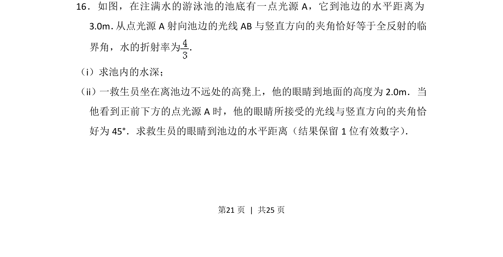
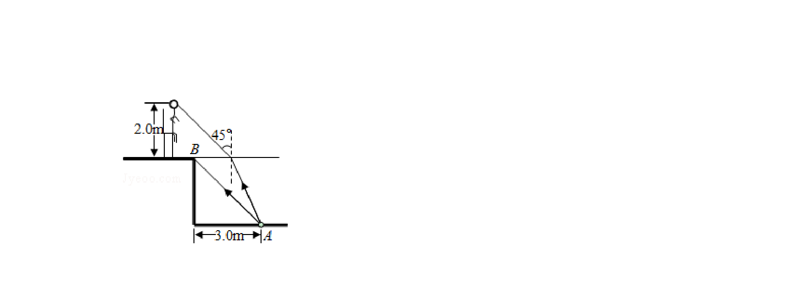
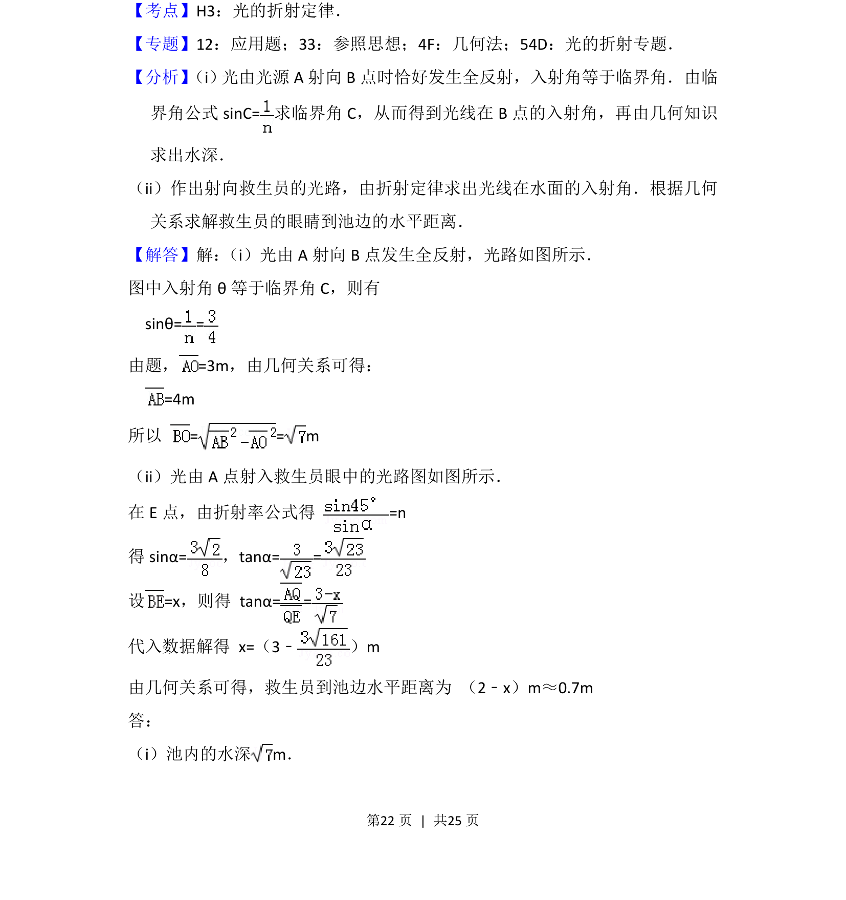
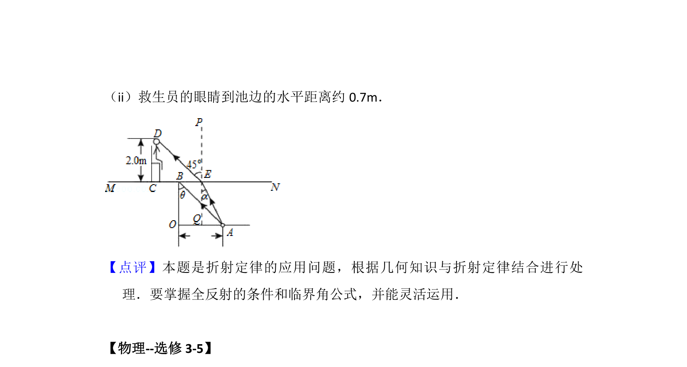

## 题面

## 摘要

求池水深和救生员眼睛到池边的水平距离，综合运用全反射临界角公式与折射定律解决几何光学问题。

## 关联考点

- [[343-全反射|全反射]]
- [[336-临界角|临界角]]
- [[026-折射定律|折射定律]]
- [[455-几何光学|几何光学]]

## 答案与解析

> 📄 原 PDF 第 21 页：`素材/真题/湖南/2008-2024·（湖南）物理高考真题/2016年高考物理试卷（新课标Ⅰ）（解析卷）.pdf`

<!-- 题干文本-start -->
## 题干文本
16．如图，在注满水的游泳池的池底有一点光源A，它到池边的水平距离为
3.0m． 从点光源A射向池边的光线AB与竖直方向的夹角恰好等于全反射的临
界角，水的折射率为 ．
（i）求池内的水深；
（ii）一救生员坐在离池边不远处的高凳上，他的眼睛到地面的高度为2.0m．当
他看到正前下方的点光源A时，他的眼睛所接受的光线与竖直方向的夹角恰
好为45°．求救生员的眼睛到池边的水平距离（结果保留1位有效数字） ．
<!-- 题干文本-end -->

<!-- 解析文本-start -->
## 解析文本

<!-- 解析文本-end -->
