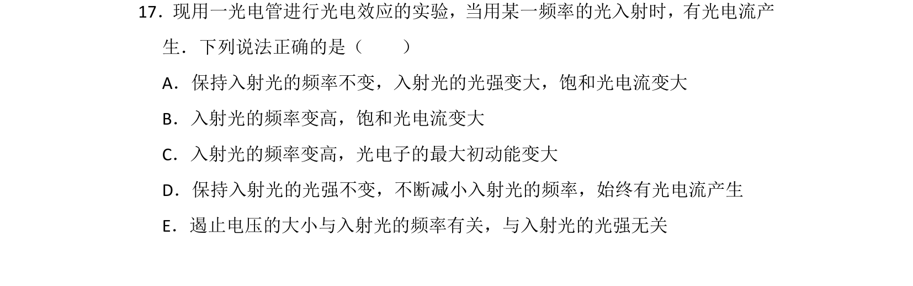
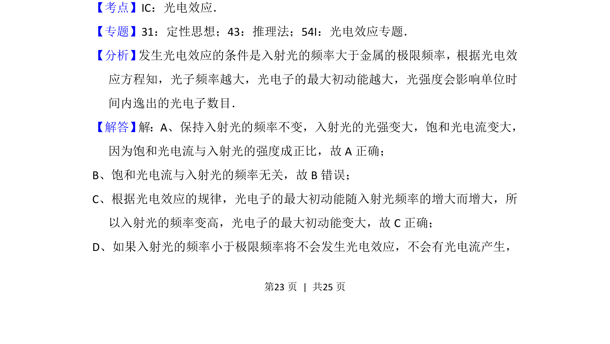
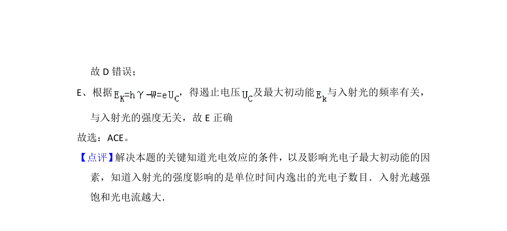

## 题面

## 摘要

该题考查光电效应现象及其规律，涉及饱和光电流、最大初动能、遏止电压与入射光频率和光强的关系。

## 关联考点

- [[417-光电效应|光电效应]]
- [[饱和光电流]]
- [[最大初动能]]
- [[781-遏止电压|遏止电压]]

## 答案与解析

> 📄 原 PDF 第 23 页：`素材/真题/湖南/2008-2024·（湖南）物理高考真题/2016年高考物理试卷（新课标Ⅰ）（解析卷）.pdf`
