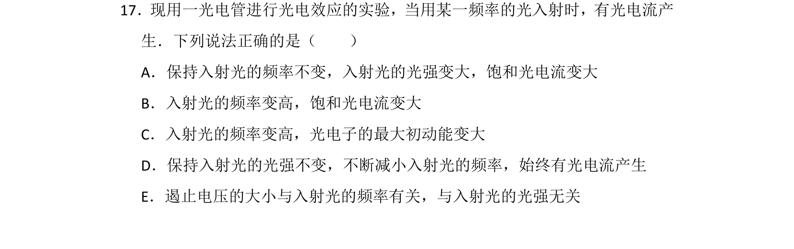
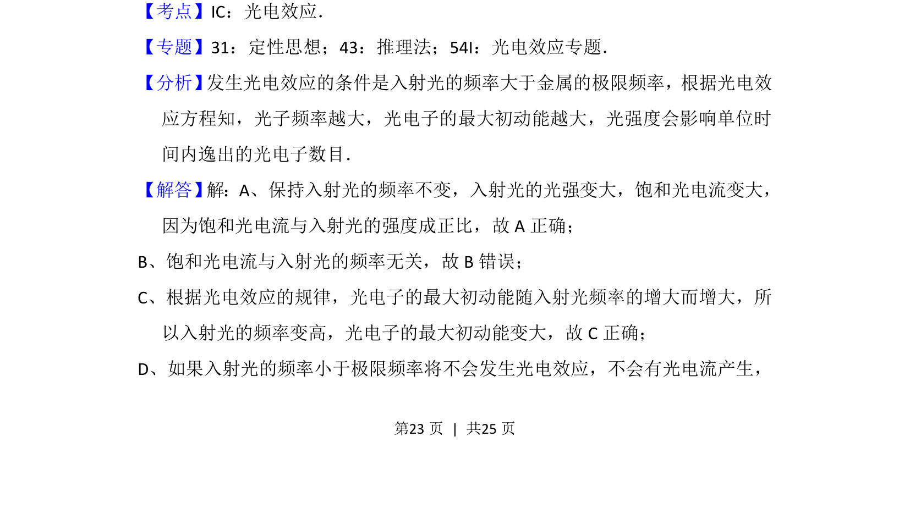
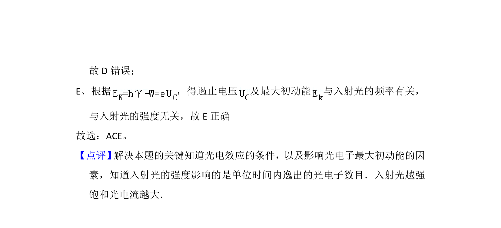

## 题面

## 摘要

该题考查光电效应现象及其规律，涉及饱和光电流、最大初动能、遏止电压与入射光频率和光强的关系。

## 关联考点

- [[417-光电效应|光电效应]]
- [[饱和光电流]]
- [[最大初动能]]
- [[781-遏止电压|遏止电压]]

## 答案与解析

> 📄 原 PDF 第 23 页：`素材/真题/湖南/2008-2024·（湖南）物理高考真题/2016年高考物理试卷（新课标Ⅰ）（解析卷）.pdf`

<!-- 题干文本-start -->
## 题干文本
17．现用一光电管进行光电效应的实验，当用某一频率的光入射时，有光电流产
生．下列说法正确的是（　　）
A．保持入射光的频率不变，入射光的光强变大，饱和光电流变大
B．入射光的频率变高，饱和光电流变大
C．入射光的频率变高，光电子的最大初动能变大
D．保持入射光的光强不变，不断减小入射光的频率，始终有光电流产生
E．遏止电压的大小与入射光的频率有关，与入射光的光强无关
<!-- 题干文本-end -->

<!-- 解析文本-start -->
## 解析文本
【考点】IC：光电效应．菁优网版权所有
【专题】31：定性思想；43：推理法；54I：光电效应专题．
【分析】 发生光电效应的条件是入射光的频率大于金属的极限频率，根据光电效
应方程知，光子频率越大，光电子的最大初动能越大，光强度会影响单位时
间内逸出的光电子数目．
【解答】 解：A、保持入射光的频率不变，入射光的光强变大，饱和光电流变大，
因为饱和光电流与入射光的强度成正比，故A正确；
B、饱和光电流与入射光的频率无关，故B错误；
C、根据光电效应的规律，光电子的最大初动能随入射光频率的增大而增大，所
以入射光的频率变高，光电子的最大初动能变大，故C正确；
D、如果入射光的频率小于极限频率将不会发生光电效应，不会有光电流产生，
<!-- 解析文本-end -->
