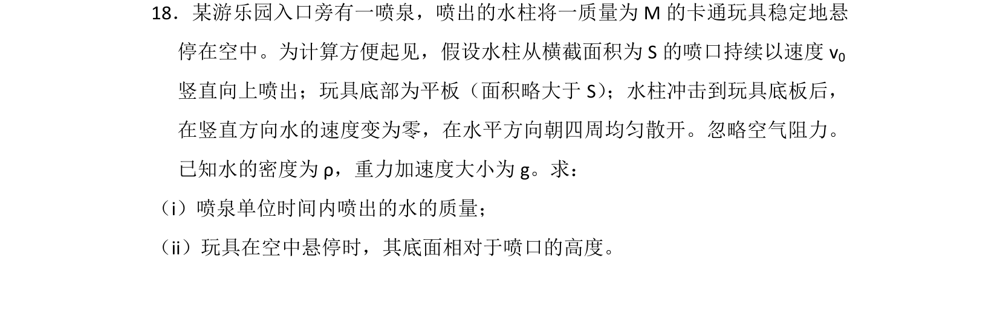
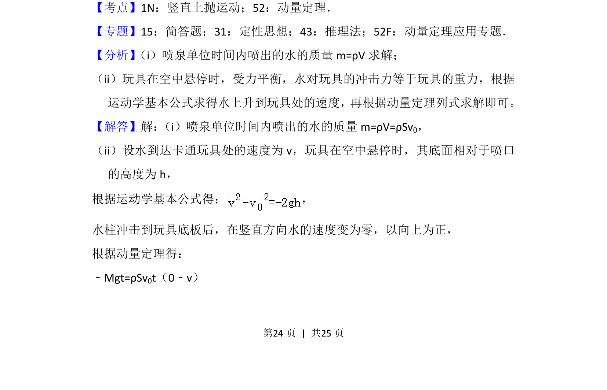
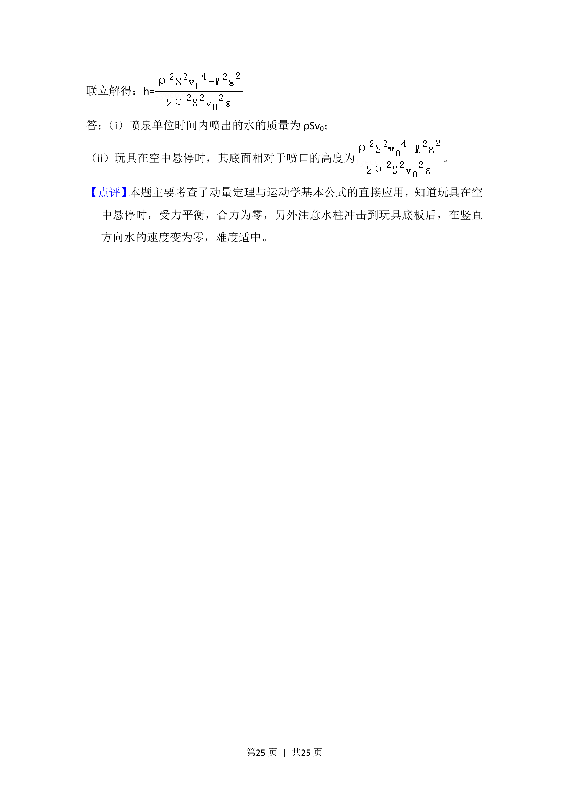

## 题面

## 摘要

利用动量定理和竖直上抛运动规律，求解喷泉单位时间喷水质量及玩具悬停高度。

## 关联考点

- [[349-动量定理|动量定理]]
- [[706-竖直上抛运动|竖直上抛运动]]
- [[质量流量]]

## 答案与解析

> 📄 原 PDF 第 24 页：`素材/真题/湖南/2008-2024·（湖南）物理高考真题/2016年高考物理试卷（新课标Ⅰ）（解析卷）.pdf`
