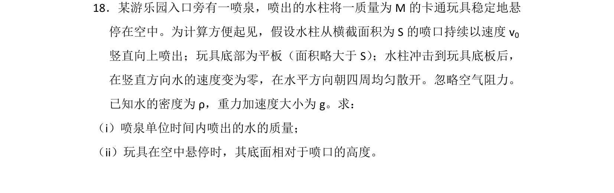
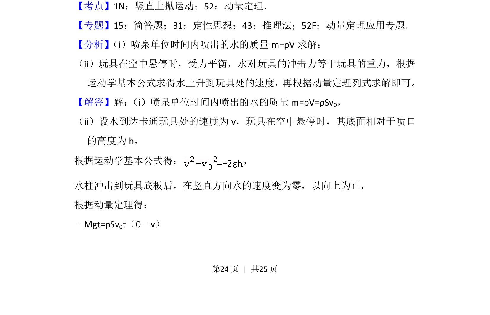
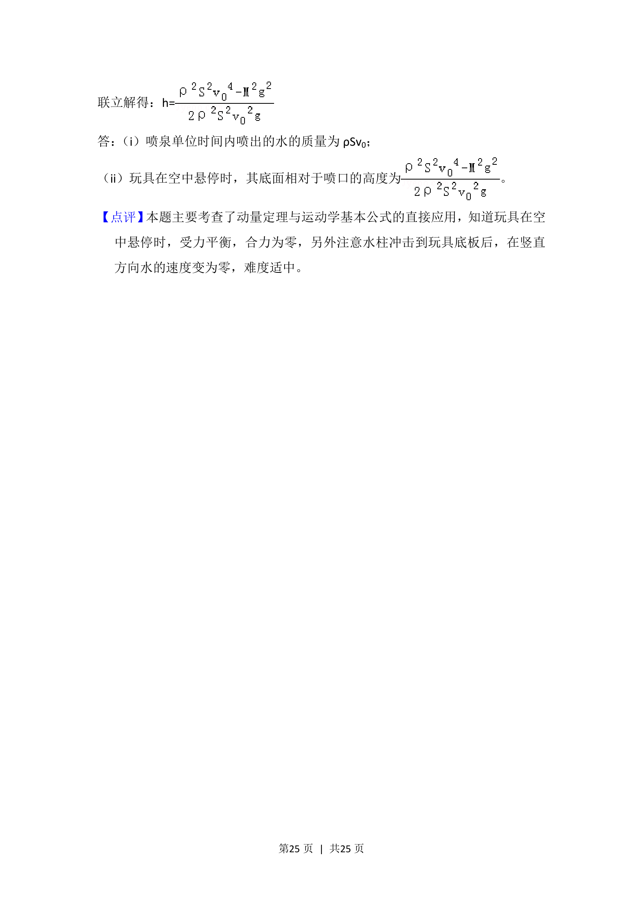

## 题面

## 摘要

利用动量定理和竖直上抛运动规律，求解喷泉单位时间喷水质量及玩具悬停高度。

## 关联考点

- [[349-动量定理|动量定理]]
- [[706-竖直上抛运动|竖直上抛运动]]
- [[质量流量]]

## 答案与解析

> 📄 原 PDF 第 24 页：`素材/真题/湖南/2008-2024·（湖南）物理高考真题/2016年高考物理试卷（新课标Ⅰ）（解析卷）.pdf`

<!-- 题干文本-start -->
## 题干文本
18．某游乐园入口旁有一喷泉，喷出的水柱将一质量为M的卡通玩具稳定地悬
停在空中。为计算方便起见，假设水柱从横截面积为S的喷口持续以速度v 0
竖直向上喷出；玩具底部为平板（面积略大于S） ；水柱冲击到玩具底板后，
在竖直方向水的速度变为零，在水平方向朝四周均匀散开。忽略空气阻力。
已知水的密度为ρ，重力加速度大小为g。求：
（i）喷泉单位时间内喷出的水的质量；
（ii）玩具在空中悬停时，其底面相对于喷口的高度。
<!-- 题干文本-end -->

<!-- 解析文本-start -->
## 解析文本
【考点】1N：竖直上抛运动；52：动量定理．菁优网版权所有
【专题】15：简答题；31：定性思想；43：推理法；52F：动量定理应用专题．
【分析】 （i）喷泉单位时间内喷出的水的质量m=ρV求解；
（ii）玩具在空中悬停时，受力平衡，水对玩具的冲击力等于玩具的重力，根据
运动学基本公式求得水上升到玩具处的速度，再根据动量定理列式求解即可。
【解答】解： （i）喷泉单位时间内喷出的水的质量m=ρV=ρSv0，
（ii）设水到达卡通玩具处的速度为v，玩具在空中悬停时，其底面相对于喷口
的高度为h，
根据运动学基本公式得： ，
水柱冲击到玩具底板后，在竖直方向水的速度变为零，以向上为正，
根据动量定理得：
﹣Mgt=ρSv0t（0﹣v）
<!-- 解析文本-end -->
