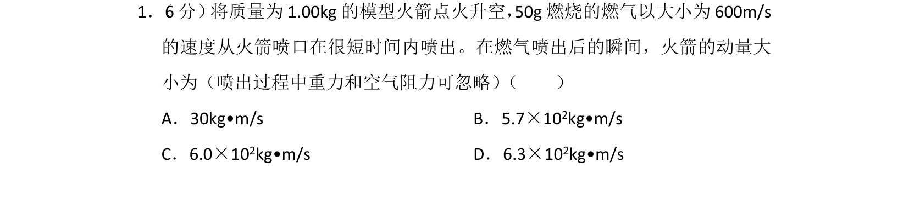
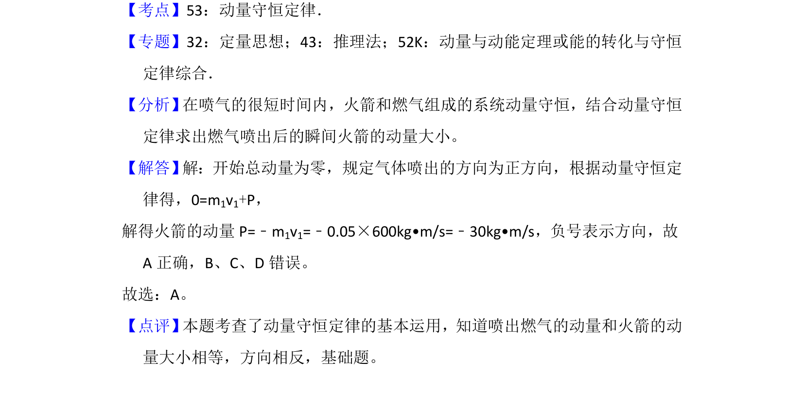

## 题面

## 摘要

模型火箭喷气过程，应用动量守恒定律求解喷气后瞬间火箭的动量。

## 关联考点

- [[347-动量守恒定律|动量守恒定律]]
- [[346-动量|动量]]
- [[反冲]]

## 答案与解析

> 📄 原 PDF 第 1 页：`素材/真题/湖南/2008-2024·（湖南）物理高考真题/2017年高考物理试卷（新课标Ⅰ）（解析卷）.pdf`

<!-- 题干文本-start -->
## 题干文本
1． （6分） 将质量为1.00kg的模型火箭点火升空，50g燃烧的燃气以大小为600m/s
的速度从火箭喷口在很短时间内喷出。在燃气喷出后的瞬间，火箭的动量大
小为（喷出过程中重力和空气阻力可忽略） （　　）
A．30kg•m/s B．5.7×10 2kg•m/s
C．6.0×102kg•m/s D．6.3×10 2kg•m/s
<!-- 题干文本-end -->

<!-- 解析文本-start -->
## 解析文本
【考点】53：动量守恒定律．菁优网版权所有
【专题】32：定量思想；43：推理法；52K：动量与动能定理或能的转化与守恒
定律综合．
【分析】 在喷气的很短时间内，火箭和燃气组成的系统动量守恒，结合动量守恒
定律求出燃气喷出后的瞬间火箭的动量大小。
【解答】 解：开始总动量为零，规定气体喷出的方向为正方向，根据动量守恒定
律得，0=m1v1+P，
解得火箭的动量P=﹣m 1v1=﹣0.05×600kg•m/s=﹣30kg•m/s，负号表示方向，故
A正确，B、C、D错误。
故选：A。
【点评】 本题考查了动量守恒定律的基本运用，知道喷出燃气的动量和火箭的动
量大小相等，方向相反，基础题。
<!-- 解析文本-end -->
