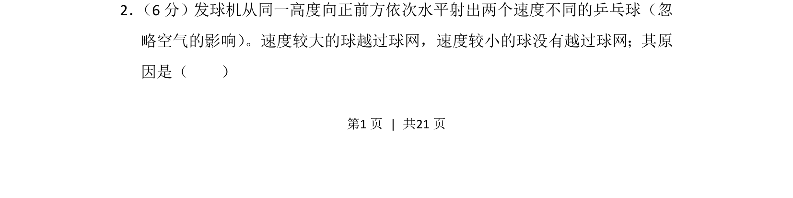
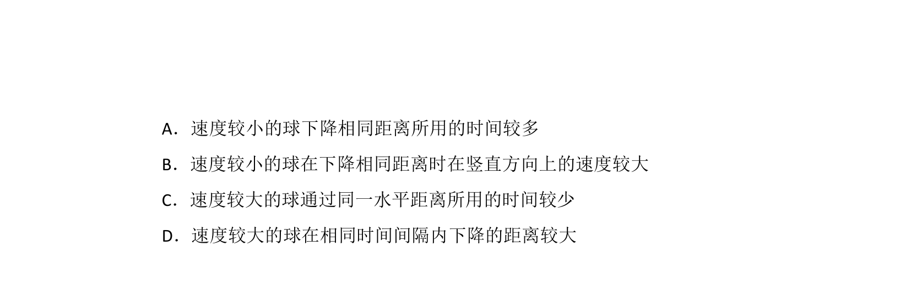
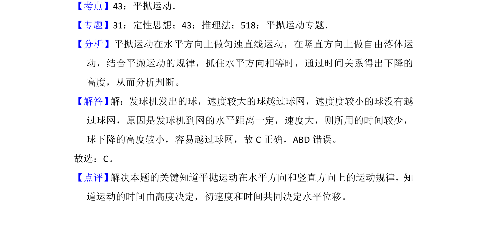

## 题面

## 摘要

发球机水平射出的乒乓球做平抛运动，速度较大的球水平位移更大，下落时间相同，因此能过网。

## 关联考点

- [[261-平抛运动|平抛运动]]
- [[288-运动的合成与分解|运动的合成与分解]]
- [[水平位移]]
- [[竖直位移]]

## 答案与解析

> 📄 原 PDF 第 1 页：`素材/真题/湖南/2008-2024·（湖南）物理高考真题/2017年高考物理试卷（新课标Ⅰ）（解析卷）.pdf`
