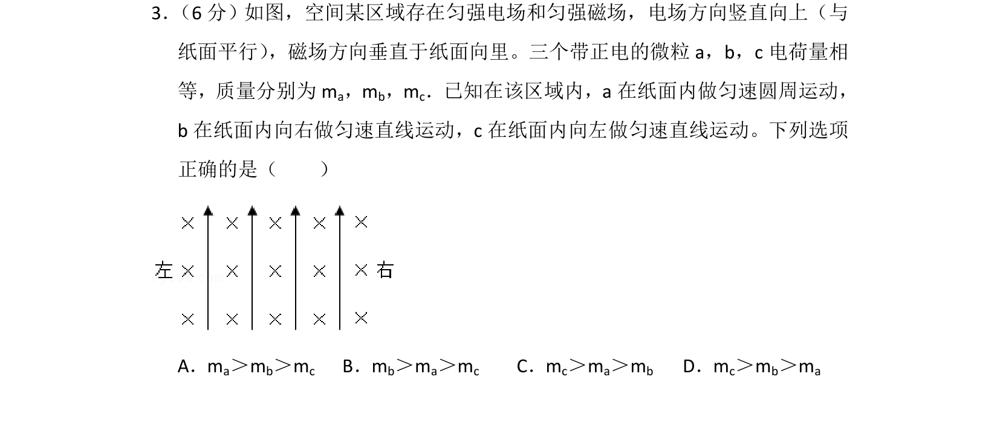
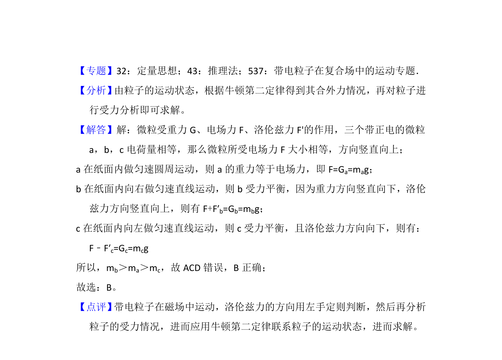

## 题面

## 摘要

带电微粒在重力、电场和磁场复合场中做圆周或匀速直线运动，根据受力平衡比较质量关系。

## 关联考点

- [[844-带电粒子在复合场中的运动|带电粒子在复合场中的运动]]
- [[533-力的平衡|力的平衡]]
- [[304-洛伦兹力|洛伦兹力]]
- [[672-电场力|电场力]]

## 答案与解析

> 📄 原 PDF 第 2 页：`素材/真题/湖南/2008-2024·（湖南）物理高考真题/2017年高考物理试卷（新课标Ⅰ）（解析卷）.pdf`
