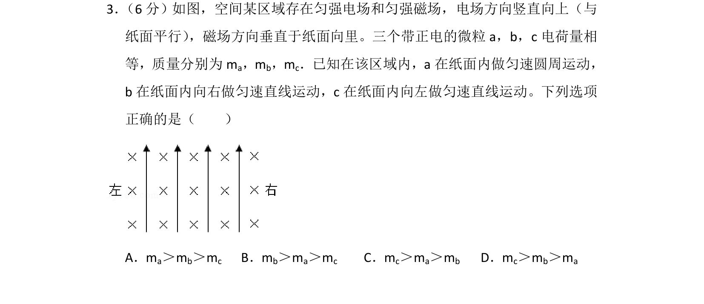
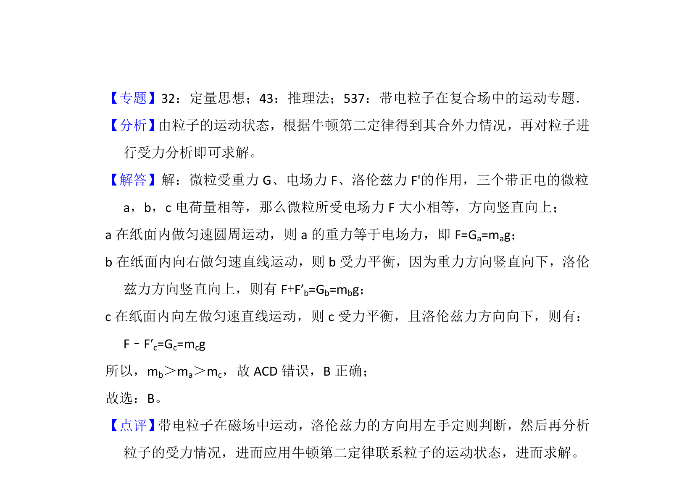

## 题面

## 摘要

带电微粒在重力、电场和磁场复合场中做圆周或匀速直线运动，根据受力平衡比较质量关系。

## 关联考点

- [[844-带电粒子在复合场中的运动|带电粒子在复合场中的运动]]
- [[533-力的平衡|力的平衡]]
- [[304-洛伦兹力|洛伦兹力]]
- [[672-电场力|电场力]]

## 答案与解析

> 📄 原 PDF 第 2 页：`素材/真题/湖南/2008-2024·（湖南）物理高考真题/2017年高考物理试卷（新课标Ⅰ）（解析卷）.pdf`

<!-- 题干文本-start -->
## 题干文本
3． （6分）如图，空间某区域存在匀强电场和匀强磁场，电场方向竖直向上（与
纸面平行） ，磁场方向垂直于纸面向里。三个带正电的微粒a，b，c电荷量相
等，质量分别为m a，mb，mc．已知在该区域内，a在纸面内做匀速圆周运动，
b在纸面内向右做匀速直线运动，c在纸面内向左做匀速直线运动。下列选项
正确的是（　　）
A．ma＞mb＞mc B．mb＞ma＞mc C．mc＞ma＞mb D．mc＞mb＞ma
<!-- 题干文本-end -->

<!-- 解析文本-start -->
## 解析文本
【考点】CM：带电粒子在混合场中的运动．菁优网版权所有
<!-- 解析文本-end -->
