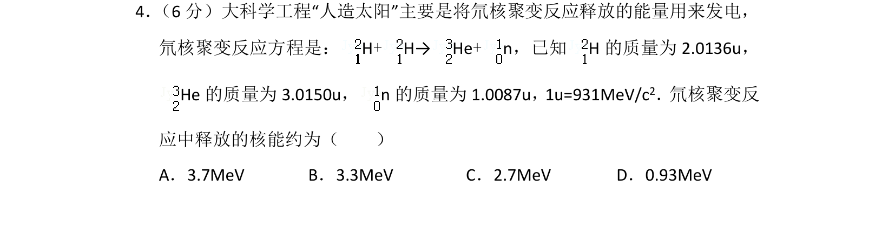
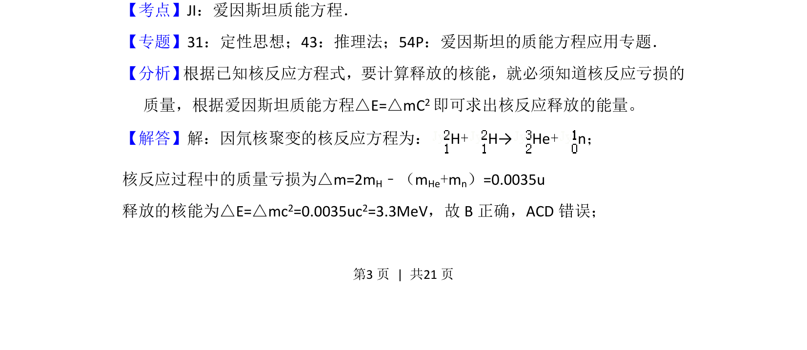
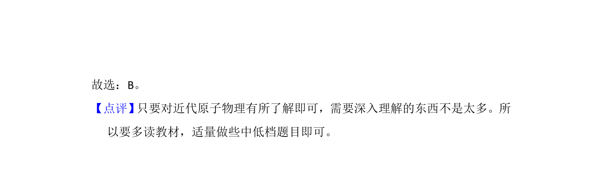

## 题面

## 摘要

通过氘核聚变反应方程和质量亏损，利用爱因斯坦质能方程计算释放的核能。

## 关联考点

- [[140-核能|核聚变]]
- [[449-质能方程|质量亏损]]
- [[661-爱因斯坦质能方程|爱因斯坦质能方程]]

## 答案与解析

> 📄 原 PDF 第 3 页：`素材/真题/湖南/2008-2024·（湖南）物理高考真题/2017年高考物理试卷（新课标Ⅰ）（解析卷）.pdf`
