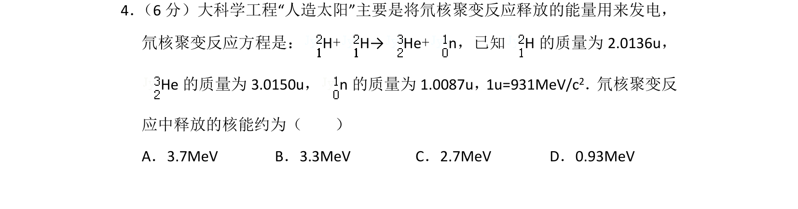
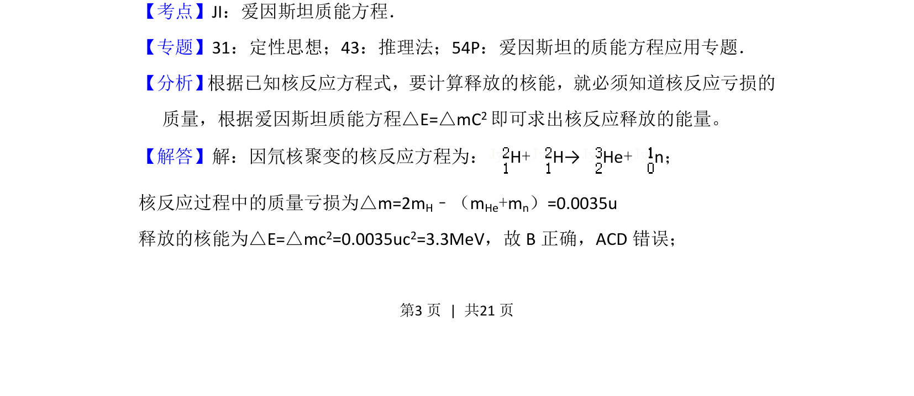
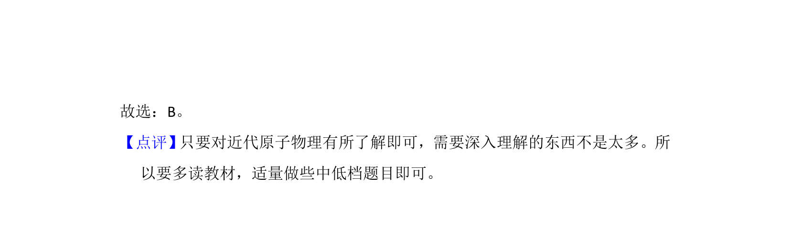

## 题面

## 摘要

通过氘核聚变反应方程和质量亏损，利用爱因斯坦质能方程计算释放的核能。

## 关联考点

- [[140-核能|核聚变]]
- [[449-质能方程|质量亏损]]
- [[661-爱因斯坦质能方程|爱因斯坦质能方程]]

## 答案与解析

> 📄 原 PDF 第 3 页：`素材/真题/湖南/2008-2024·（湖南）物理高考真题/2017年高考物理试卷（新课标Ⅰ）（解析卷）.pdf`

<!-- 题干文本-start -->
## 题干文本
4． （6分）大科学工程“人造太阳”主要是将氘核聚变反应释放的能量用来发电，
氘核聚变反应方程是：H+H→He+n，已知H的质量为2.0136u，
He的质量为3.0150u，n的质量为1.0087u，1u=931MeV/c 2．氘核聚变反
应中释放的核能约为（　　）
A．3.7MeV B．3.3MeV C．2.7MeV D．0.93MeV
<!-- 题干文本-end -->

<!-- 解析文本-start -->
## 解析文本
【考点】JI：爱因斯坦质能方程．菁优网版权所有
【专题】31：定性思想；43：推理法；54P：爱因斯坦的质能方程应用专题．
【分析】 根据已知核反应方程式，要计算释放的核能，就必须知道核反应亏损的
质量，根据爱因斯坦质能方程△E=△mC2即可求出核反应释放的能量。
【解答】解：因氘核聚变的核反应方程为：H+H→He+n；
核反应过程中的质量亏损为△m=2mH﹣（mHe+mn）=0.0035u
释放的核能为△E=△mc2=0.0035uc2=3.3MeV，故B正确，ACD错误；
<!-- 解析文本-end -->
