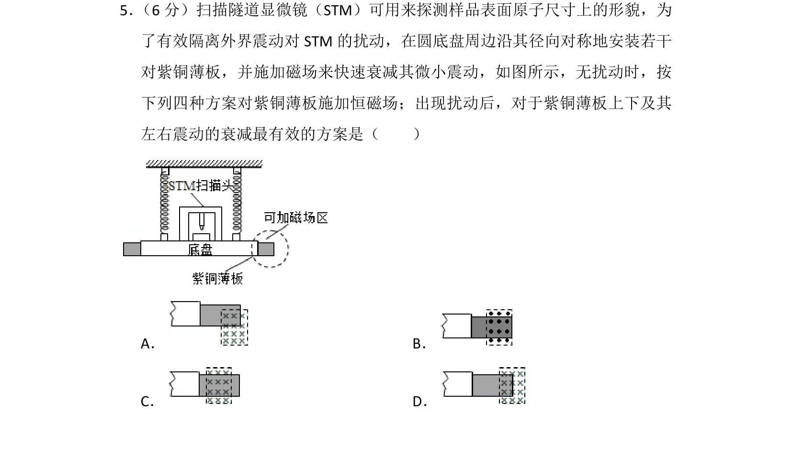
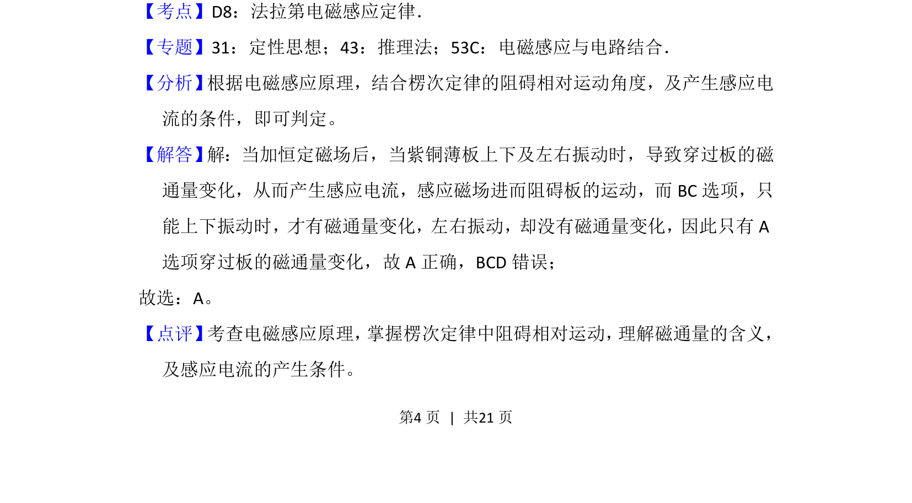

## 题面

## 摘要

考查电磁阻尼原理，通过分析不同磁场方案下紫铜薄板振动时磁通量变化，判断衰减效果。

## 关联考点

- [[395-法拉第电磁感应定律|法拉第电磁感应定律]]
- [[393-楞次定律|楞次定律]]
- [[325-磁通量|磁通量]]
- [[175-电磁感应|感应电流]]

## 答案与解析

> 📄 原 PDF 第 4 页：`素材/真题/湖南/2008-2024·（湖南）物理高考真题/2017年高考物理试卷（新课标Ⅰ）（解析卷）.pdf`
