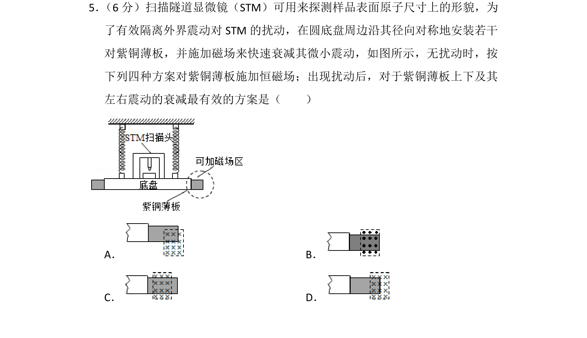
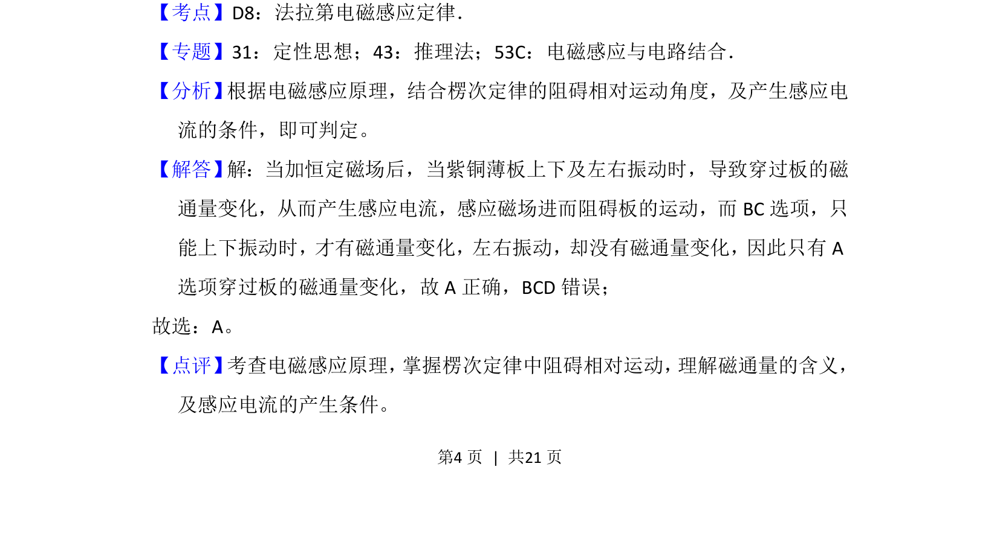

## 题面

## 摘要

考查电磁阻尼原理，通过分析不同磁场方案下紫铜薄板振动时磁通量变化，判断衰减效果。

## 关联考点

- [[395-法拉第电磁感应定律|法拉第电磁感应定律]]
- [[393-楞次定律|楞次定律]]
- [[325-磁通量|磁通量]]
- [[175-电磁感应|感应电流]]

## 答案与解析

> 📄 原 PDF 第 4 页：`素材/真题/湖南/2008-2024·（湖南）物理高考真题/2017年高考物理试卷（新课标Ⅰ）（解析卷）.pdf`

<!-- 题干文本-start -->
## 题干文本
5． （6分）扫描隧道显微镜（STM）可用来探测样品表面原子尺寸上的形貌，为
了有效隔离外界震动对STM的扰动，在圆底盘周边沿其径向对称地安装若干
对紫铜薄板，并施加磁场来快速衰减其微小震动，如图所示，无扰动时，按
下列四种方案对紫铜薄板施加恒磁场；出现扰动后，对于紫铜薄板上下及其
左右震动的衰减最有效的方案是（　　）
A．B．
C．D．
<!-- 题干文本-end -->

<!-- 解析文本-start -->
## 解析文本
【考点】D8：法拉第电磁感应定律．菁优网版权所有
【专题】31：定性思想；43：推理法；53C：电磁感应与电路结合．
【分析】 根据电磁感应原理，结合楞次定律的阻碍相对运动角度，及产生感应电
流的条件，即可判定。
【解答】 解：当加恒定磁场后，当紫铜薄板上下及左右振动时，导致穿过板的磁
通量变化，从而产生感应电流，感应磁场进而阻碍板的运动，而BC选项，只
能上下振动时，才有磁通量变化，左右振动，却没有磁通量变化，因此只有A
选项穿过板的磁通量变化，故A正确，BCD错误；
故选：A。
【点评】 考查电磁感应原理， 掌握楞次定律中阻碍相对运动， 理解磁通量的含义，
及感应电流的产生条件。
<!-- 解析文本-end -->
