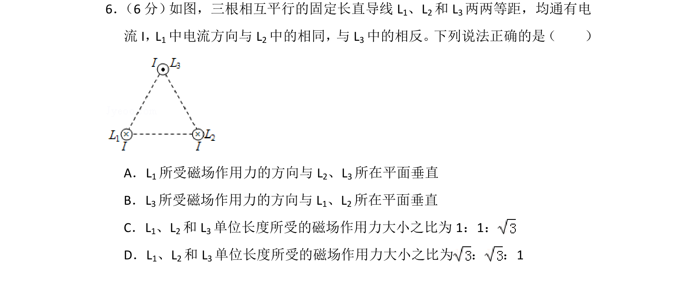
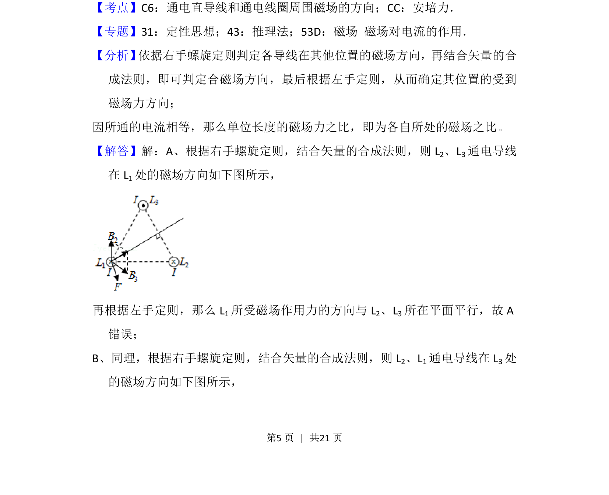
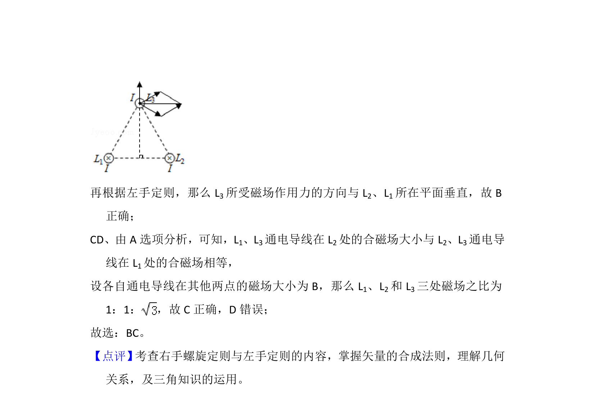

## 题面

## 摘要

三根平行通电直导线间的安培力方向与大小比较，涉及磁场叠加和左手定则。

## 关联考点

- [[通电直导线周围磁场的方向]]
- [[188-磁场对通电导体的作用|安培力]]
- [[701-矢量合成|矢量合成]]

## 答案与解析

> 📄 原 PDF 第 5 页：`素材/真题/湖南/2008-2024·（湖南）物理高考真题/2017年高考物理试卷（新课标Ⅰ）（解析卷）.pdf`
