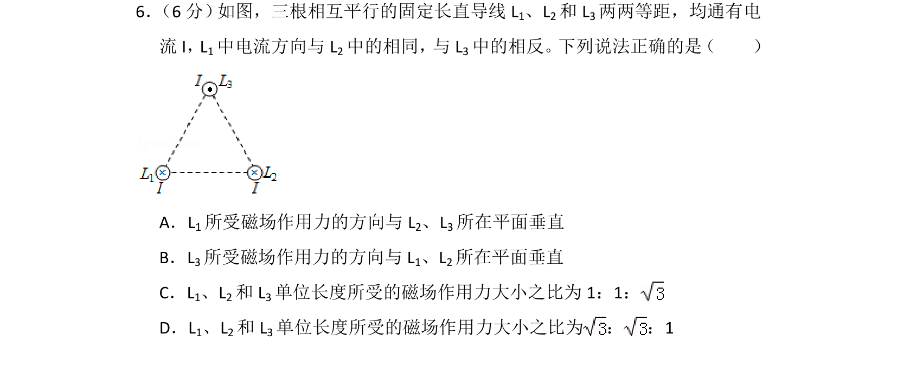
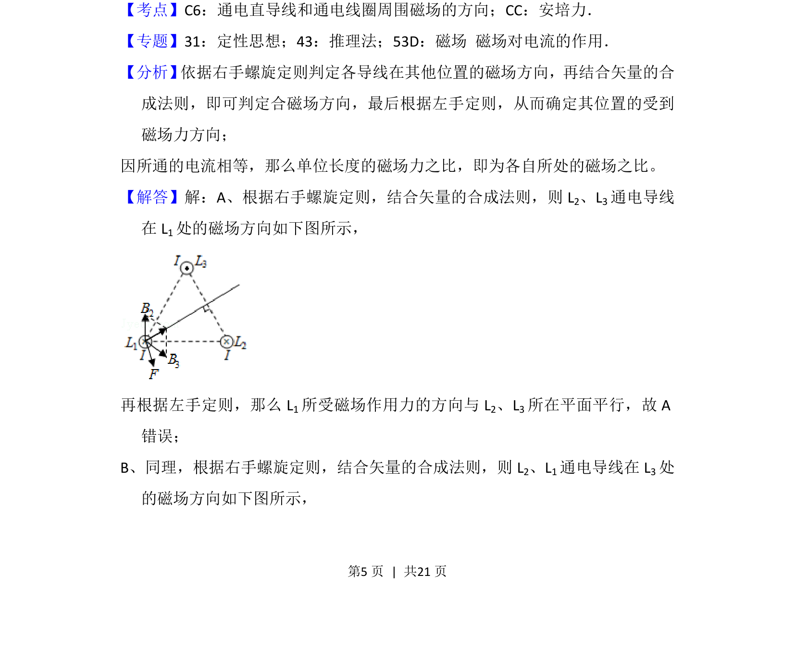
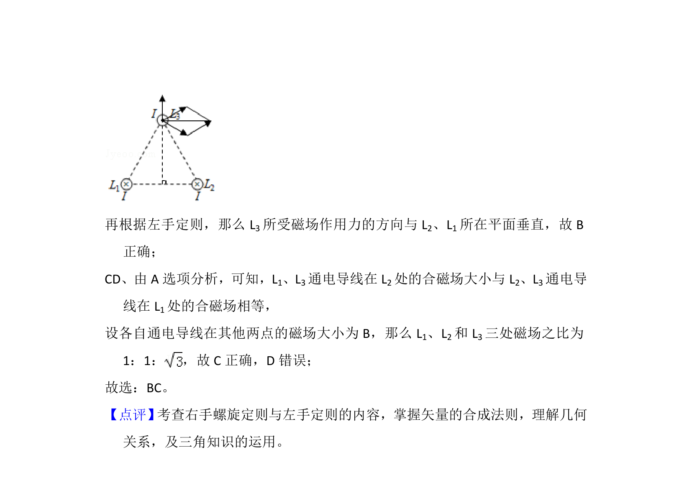

## 题面

## 摘要

三根平行通电直导线间的安培力方向与大小比较，涉及磁场叠加和左手定则。

## 关联考点

- [[通电直导线周围磁场的方向]]
- [[188-磁场对通电导体的作用|安培力]]
- [[701-矢量合成|矢量合成]]

## 答案与解析

> 📄 原 PDF 第 5 页：`素材/真题/湖南/2008-2024·（湖南）物理高考真题/2017年高考物理试卷（新课标Ⅰ）（解析卷）.pdf`

<!-- 题干文本-start -->
## 题干文本
6． （6分） 如图，三根相互平行的固定长直导线L1、L2和L 3两两等距，均通有电
流I，L1中电流方向与L 2中的相同， 与L3中的相反。 下列说法正确的是 （　　）
A．L1所受磁场作用力的方向与L 2、L3所在平面垂直
B．L3所受磁场作用力的方向与L 1、L2所在平面垂直
C．L1、L2和L 3单位长度所受的磁场作用力大小之比为1：1：
D．L1、L2和L 3单位长度所受的磁场作用力大小之比为 ： ：1
<!-- 题干文本-end -->

<!-- 解析文本-start -->
## 解析文本
【考点】C6：通电直导线和通电线圈周围磁场的方向；CC：安培力．菁优网版权所有
【专题】31：定性思想；43：推理法；53D：磁场 磁场对电流的作用．
【分析】 依据右手螺旋定则判定各导线在其他位置的磁场方向，再结合矢量的合
成法则，即可判定合磁场方向，最后根据左手定则，从而确定其位置的受到
磁场力方向；
因所通的电流相等，那么单位长度的磁场力之比，即为各自所处的磁场之比。
【解答】解：A、根据右手螺旋定则，结合矢量的合成法则，则L 2、L3通电导线
在L 1处的磁场方向如下图所示，
再根据左手定则，那么L 1所受磁场作用力的方向与L 2、L3所在平面平行，故A
错误；
B、同理，根据右手螺旋定则，结合矢量的合成法则，则L 2、L1通电导线在L 3处
的磁场方向如下图所示，
<!-- 解析文本-end -->
