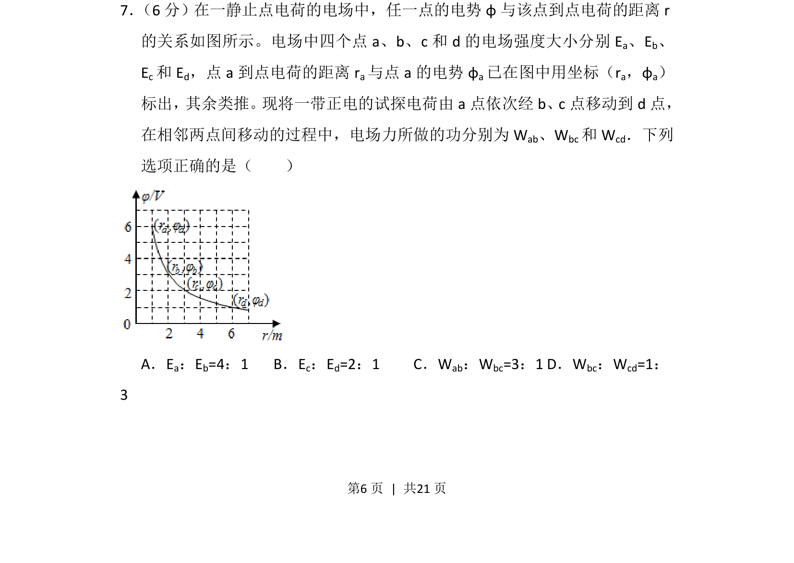
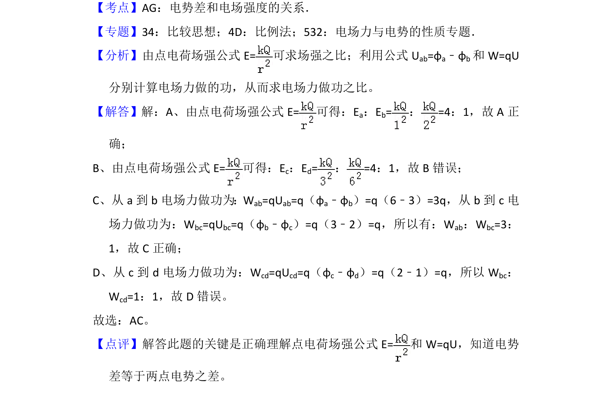

## 题面

## 摘要

根据点电荷电场电势与距离图像，分析电场强度之比和电场力做功之比。

## 关联考点

- [[864-点电荷电场强度|点电荷电场强度]]
- [[电势与距离关系]]
- [[673-电场力做功|电场力做功]]
- [[564-图像分析|图像分析]]

## 答案与解析

> 📄 原 PDF 第 6 页：`素材/真题/湖南/2008-2024·（湖南）物理高考真题/2017年高考物理试卷（新课标Ⅰ）（解析卷）.pdf`
