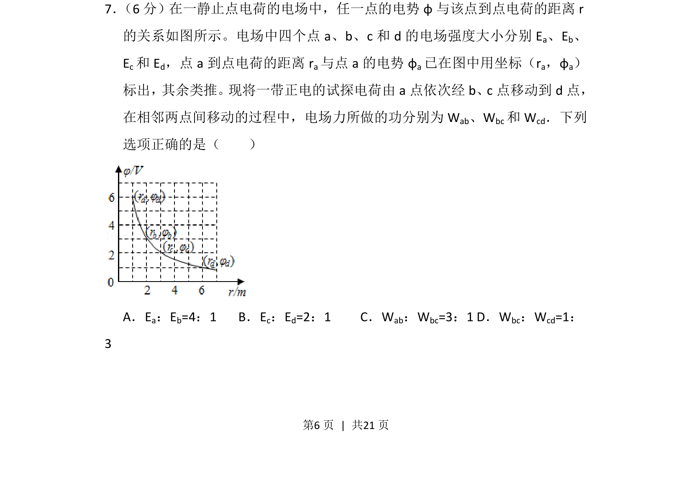
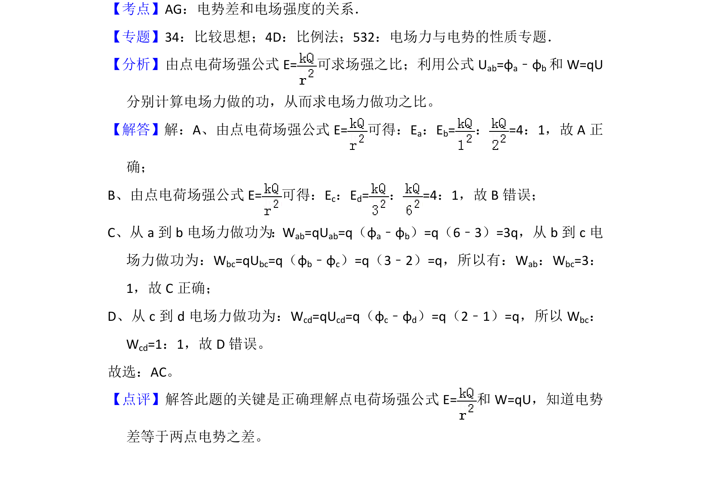

## 题面

## 摘要

根据点电荷电场电势与距离图像，分析电场强度之比和电场力做功之比。

## 关联考点

- [[864-点电荷电场强度|点电荷电场强度]]
- [[电势与距离关系]]
- [[673-电场力做功|电场力做功]]
- [[564-图像分析|图像分析]]

## 答案与解析

> 📄 原 PDF 第 6 页：`素材/真题/湖南/2008-2024·（湖南）物理高考真题/2017年高考物理试卷（新课标Ⅰ）（解析卷）.pdf`

<!-- 题干文本-start -->
## 题干文本
7． （6分）在一静止点电荷的电场中，任一点的电势φ与该点到点电荷的距离r
的关系如图所示。电场中四个点a、b、c和d的电场强度大小分别E a、Eb、
Ec和E d，点a到点电荷的距离r a与点a的电势φ a已在图中用坐标（ra，φa）
标出，其余类推。现将一带正电的试探电荷由a点依次经b、c点移动到d点，
在相邻两点间移动的过程中，电场力所做的功分别为W ab、Wbc和W cd．下列
选项正确的是（　　）
A．Ea：Eb=4：1 B．E c：Ed=2：1 C．W ab：Wbc=3：1 D．Wbc：Wcd=1：
3
<!-- 题干文本-end -->

<!-- 解析文本-start -->
## 解析文本

<!-- 解析文本-end -->
