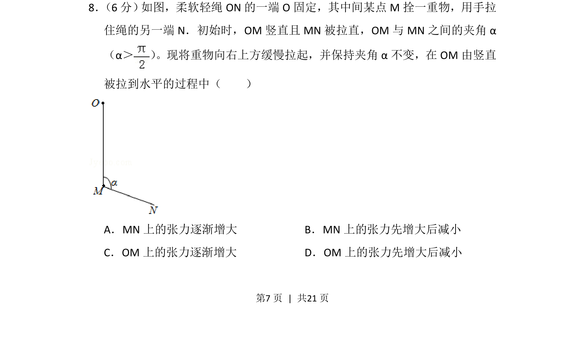
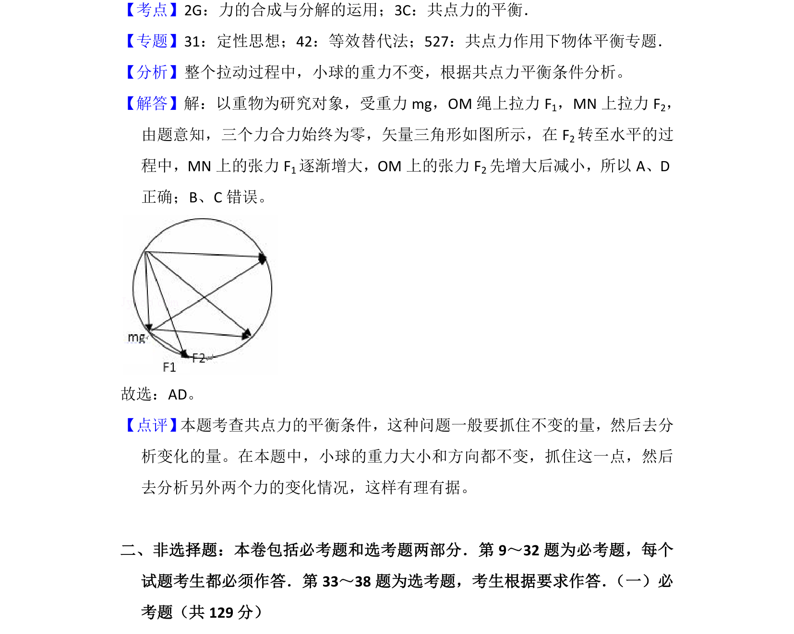

## 题面

## 摘要

重物在夹角不变的动态平衡中绳张力变化分析

## 关联考点

- [[208-共点力平衡|共点力平衡]]
- [[284-化学平衡|动态平衡]]
- [[219-平行四边形定则|平行四边形定则]]
- [[辅助圆]]

## 答案与解析

> 📄 原 PDF 第 7 页：`素材/真题/湖南/2008-2024·（湖南）物理高考真题/2017年高考物理试卷（新课标Ⅰ）（解析卷）.pdf`
