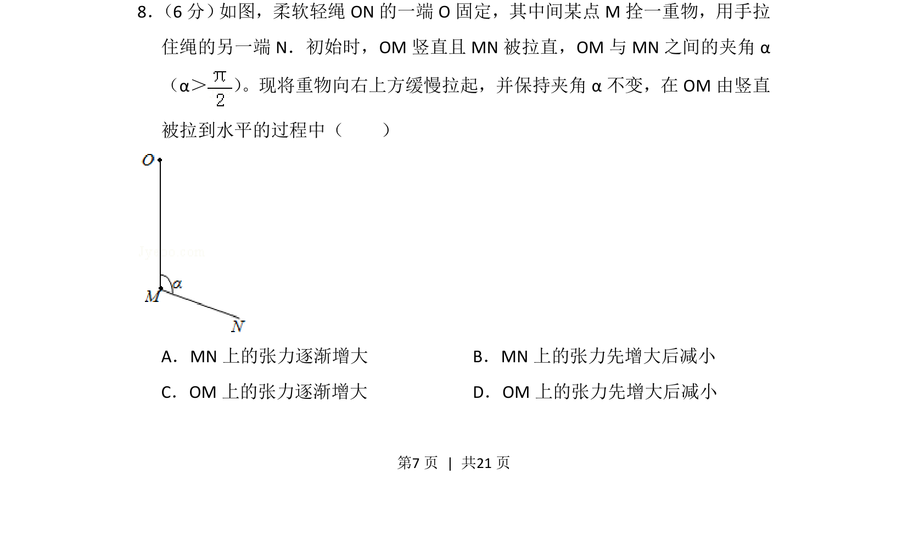
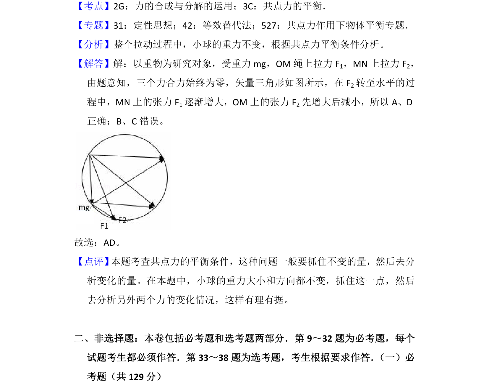

## 题面

## 摘要

重物在夹角不变的动态平衡中绳张力变化分析

## 关联考点

- [[208-共点力平衡|共点力平衡]]
- [[284-化学平衡|动态平衡]]
- [[219-平行四边形定则|平行四边形定则]]
- [[辅助圆]]

## 答案与解析

> 📄 原 PDF 第 7 页：`素材/真题/湖南/2008-2024·（湖南）物理高考真题/2017年高考物理试卷（新课标Ⅰ）（解析卷）.pdf`

<!-- 题干文本-start -->
## 题干文本
8． （6分） 如图，柔软轻绳ON的一端O固定，其中间某点M拴一重物，用手拉
住绳的另一端N．初始时，OM竖直且MN被拉直，OM与MN之间的夹角α
（α＞ ） 。现将重物向右上方缓慢拉起，并保持夹角α不变，在OM由竖直
被拉到水平的过程中（　　）
A．MN上的张力逐渐增大B．MN上的张力先增大后减小
C．OM上的张力逐渐增大D．OM上的张力先增大后减小
<!-- 题干文本-end -->

<!-- 解析文本-start -->
## 解析文本

<!-- 解析文本-end -->
