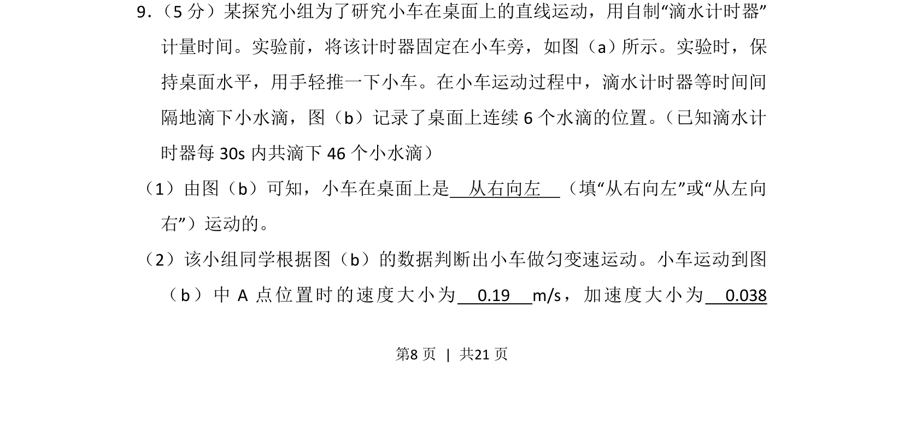
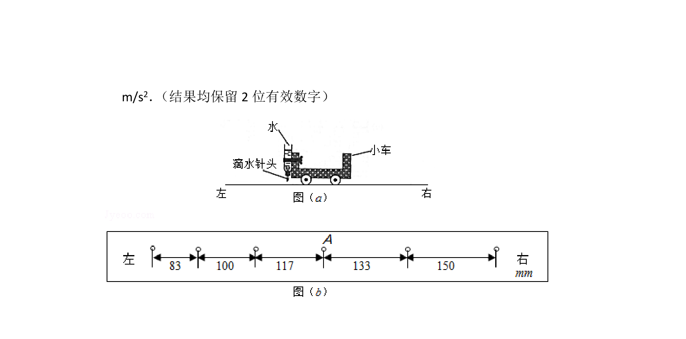
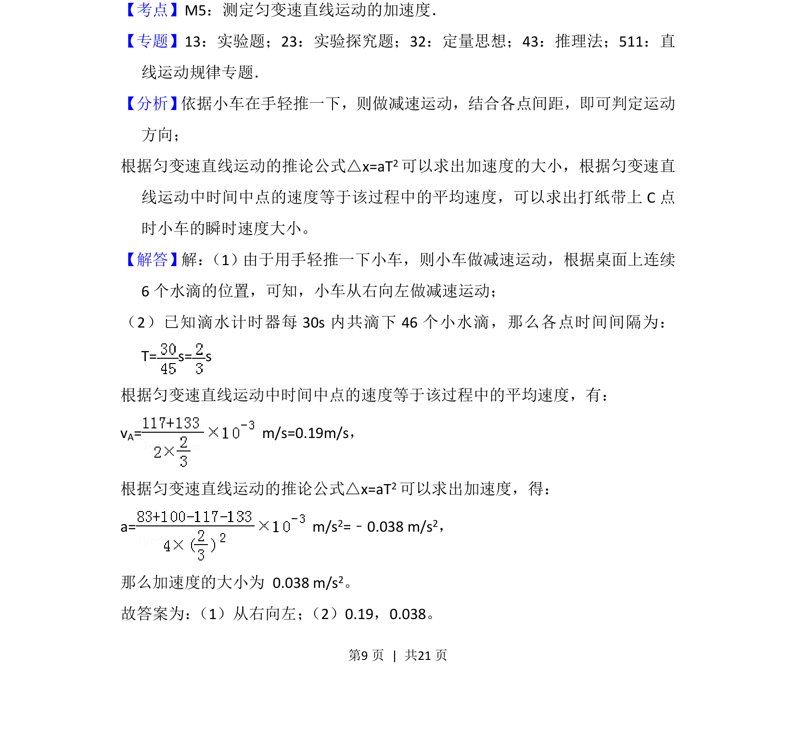

## 题面

## 摘要

探究小车匀变速直线运动，利用滴水计时器测量速度与加速度。

## 关联考点

- [[215-匀变速直线运动|匀变速直线运动]]
- [[741-逐差法求加速度|逐差法求加速度]]
- [[瞬时速度计算]]

## 答案与解析

> 📄 原 PDF 第 8 页：`素材/真题/湖南/2008-2024·（湖南）物理高考真题/2017年高考物理试卷（新课标Ⅰ）（解析卷）.pdf`
