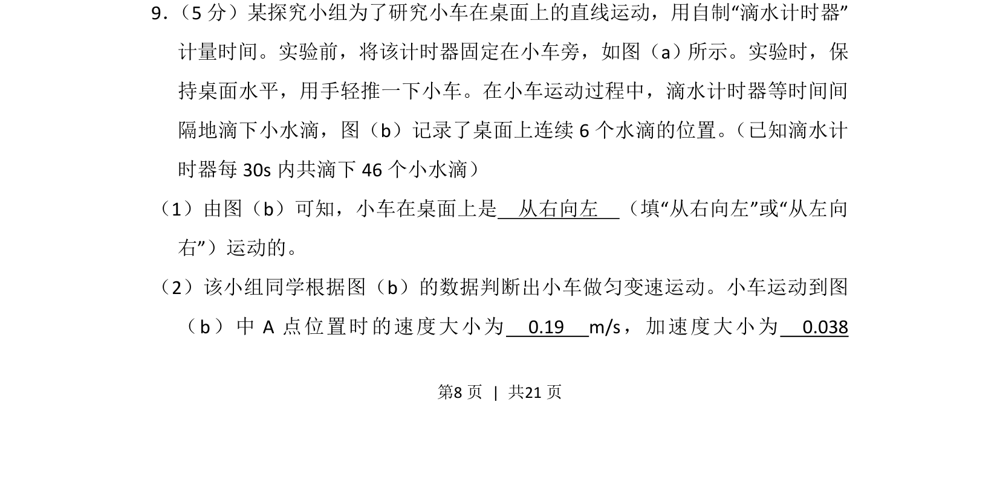
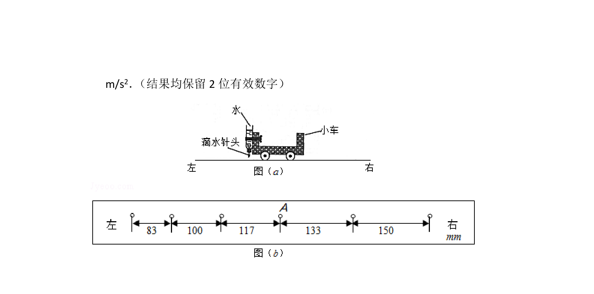
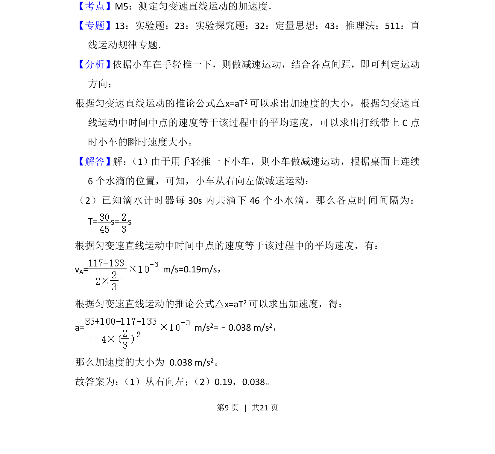
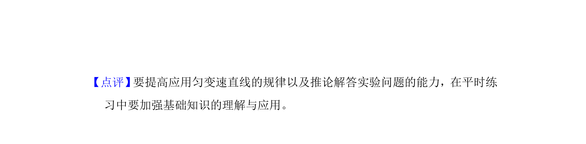

## 题面

## 摘要

探究小车匀变速直线运动，利用滴水计时器测量速度与加速度。

## 关联考点

- [[215-匀变速直线运动|匀变速直线运动]]
- [[741-逐差法求加速度|逐差法求加速度]]
- [[瞬时速度计算]]

## 答案与解析

> 📄 原 PDF 第 8 页：`素材/真题/湖南/2008-2024·（湖南）物理高考真题/2017年高考物理试卷（新课标Ⅰ）（解析卷）.pdf`

<!-- 题干文本-start -->
## 题干文本
9． （5分）某探究小组为了研究小车在桌面上的直线运动，用自制“滴水计时器”
计量时间。实验前，将该计时器固定在小车旁，如图（a）所示。实验时，保
持桌面水平，用手轻推一下小车。在小车运动过程中，滴水计时器等时间间
隔地滴下小水滴，图（b）记录了桌面上连续6个水滴的位置。 （已知滴水计
时器每30s内共滴下46个小水滴）
（1）由图（b）可知，小车在桌面上是　从右向左　（填“从右向左”或“从左向
右”）运动的。
（2）该小组同学根据图（b）的数据判断出小车做匀变速运动。小车运动到图
（b）中A点位置时的速度大小为　0.19　m/s，加速度大小为　0.038
<!-- 题干文本-end -->

<!-- 解析文本-start -->
## 解析文本

<!-- 解析文本-end -->
