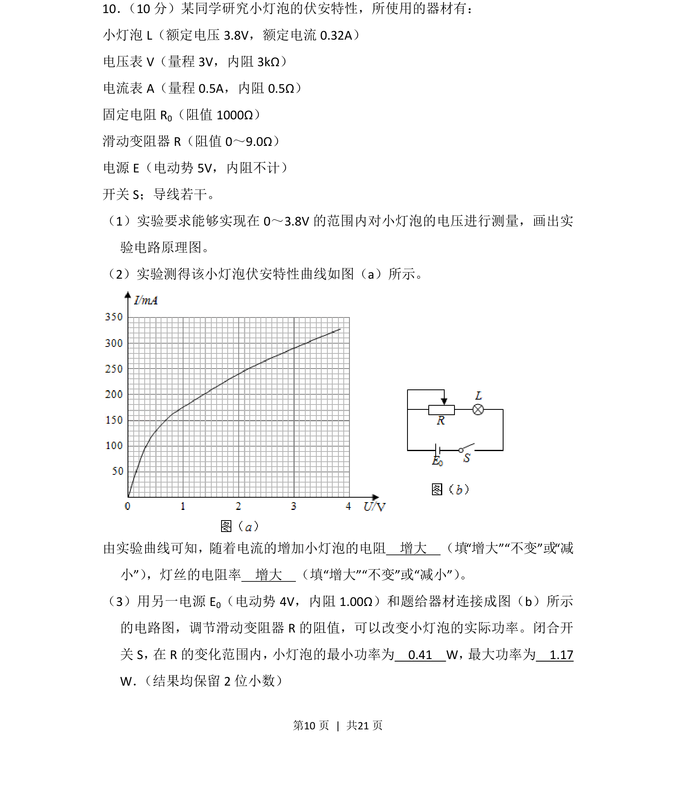
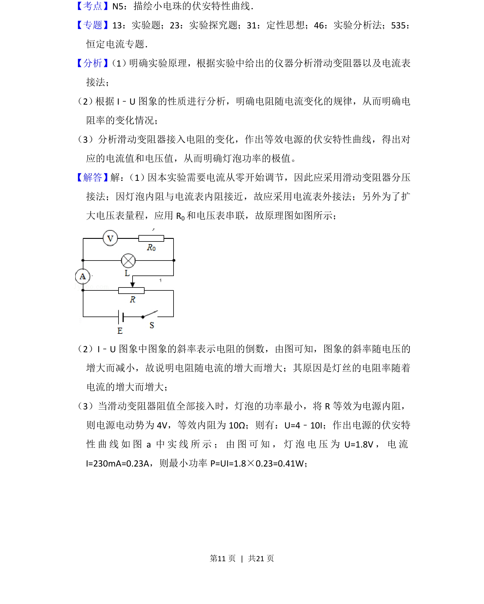
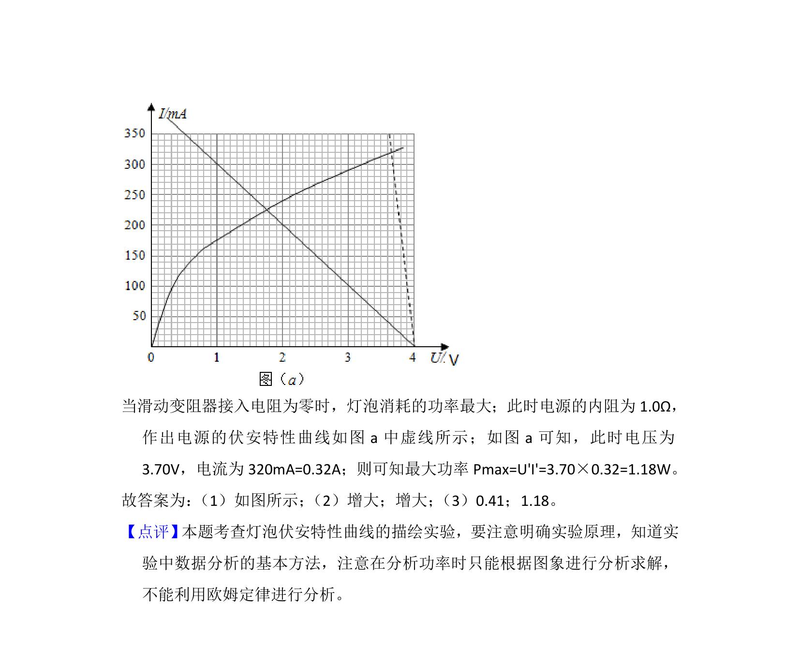

## 题面

## 摘要

研究小灯泡伏安特性实验，涉及电路设计、电阻率变化分析及功率计算。

## 关联考点

- [[512-伏安特性曲线|伏安特性曲线]]
- [[319-电阻率|电阻率]]
- [[159-电功率|电功率]]
- [[实验电路设计]]

## 答案与解析

> 📄 原 PDF 第 10 页：`素材/真题/湖南/2008-2024·（湖南）物理高考真题/2017年高考物理试卷（新课标Ⅰ）（解析卷）.pdf`
