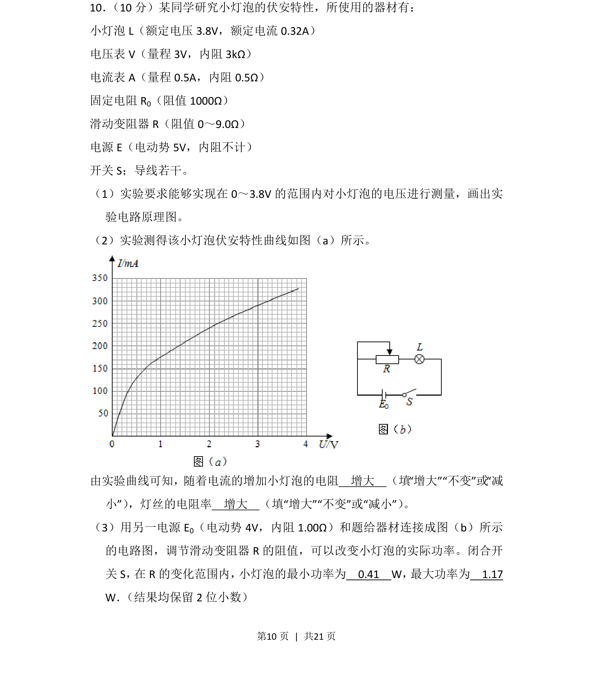
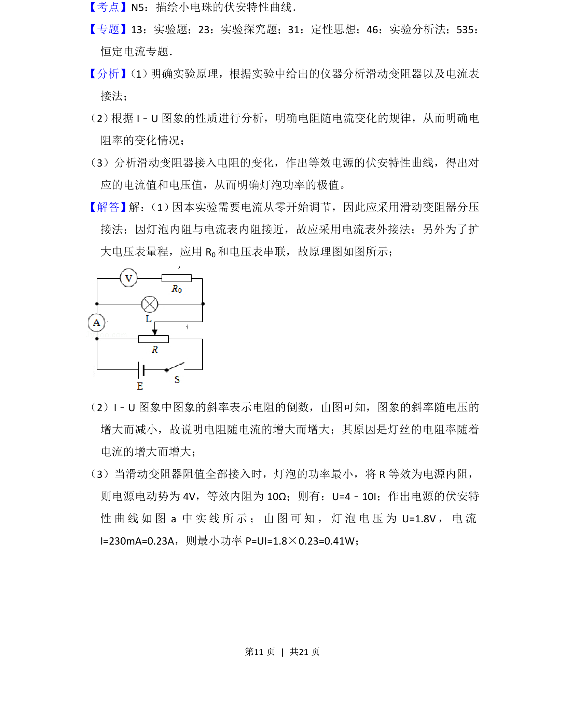
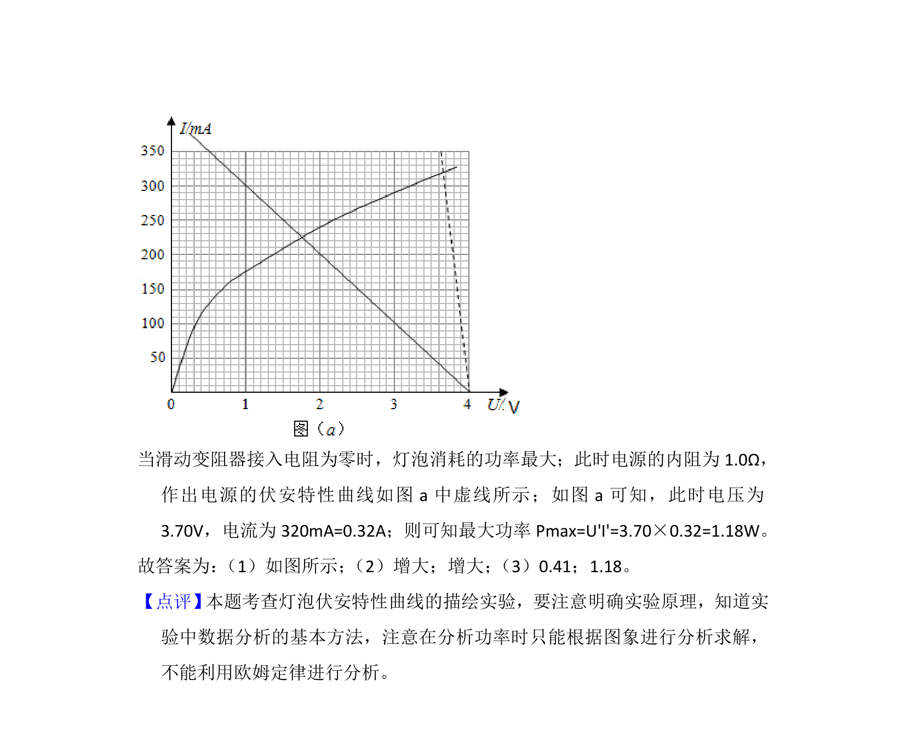

## 题面

## 摘要

研究小灯泡伏安特性实验，涉及电路设计、电阻率变化分析及功率计算。

## 关联考点

- [[512-伏安特性曲线|伏安特性曲线]]
- [[319-电阻率|电阻率]]
- [[159-电功率|电功率]]
- [[实验电路设计]]

## 答案与解析

> 📄 原 PDF 第 10 页：`素材/真题/湖南/2008-2024·（湖南）物理高考真题/2017年高考物理试卷（新课标Ⅰ）（解析卷）.pdf`

<!-- 题干文本-start -->
## 题干文本
10． （10分）某同学研究小灯泡的伏安特性，所使用的器材有：
小灯泡L（额定电压3.8V，额定电流0.32A）
电压表V（量程3V，内阻3kΩ）
电流表A（量程0.5A，内阻0.5Ω）
固定电阻R 0（阻值1000Ω）
滑动变阻器R（阻值0～9.0Ω）
电源E（电动势5V，内阻不计）
开关S；导线若干。
（1）实验要求能够实现在0～3.8V的范围内对小灯泡的电压进行测量，画出实
验电路原理图。
（2）实验测得该小灯泡伏安特性曲线如图（a）所示。
由实验曲线可知，随着电流的增加小灯泡的电阻　增大　（填“增大”“不变”或“减
小”） ，灯丝的电阻率　增大　（填“增大”“不变”或“减小”） 。
（3）用另一电源E 0（电动势4V，内阻1.00Ω）和题给器材连接成图（b）所示
的电路图，调节滑动变阻器R的阻值，可以改变小灯泡的实际功率。闭合开
关S， 在R的变化范围内， 小灯泡的最小功率为　0.41　W， 最大功率为　1.17　
W． （结果均保留2位小数）
<!-- 题干文本-end -->

<!-- 解析文本-start -->
## 解析文本

<!-- 解析文本-end -->
