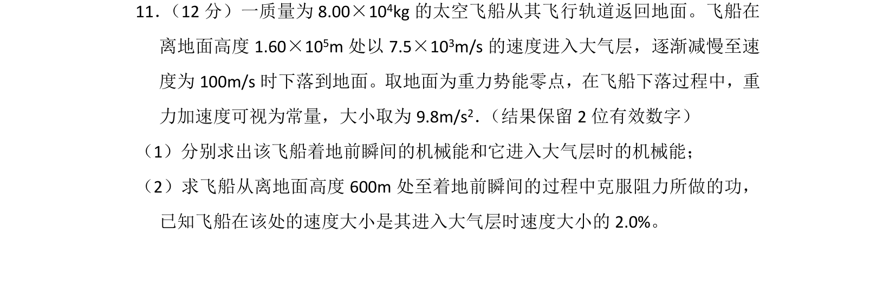
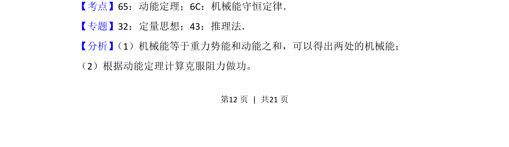
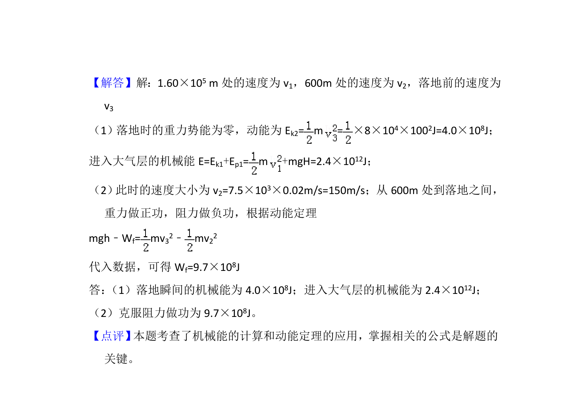

## 题面

## 摘要

飞船返回地面过程中机械能的计算及利用动能定理求克服阻力做功

## 关联考点

- [[251-动能定理|动能定理]]
- [[085-机械能守恒-初中|机械能守恒定律]]
- [[249-功能关系|功能关系]]

## 答案与解析

> 📄 原 PDF 第 12 页：`素材/真题/湖南/2008-2024·（湖南）物理高考真题/2017年高考物理试卷（新课标Ⅰ）（解析卷）.pdf`
