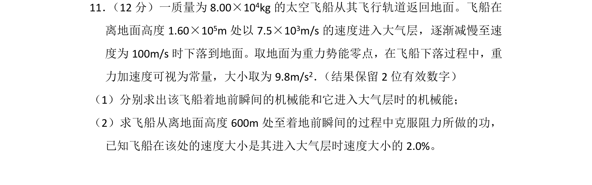
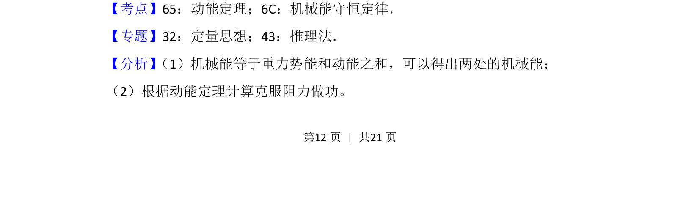
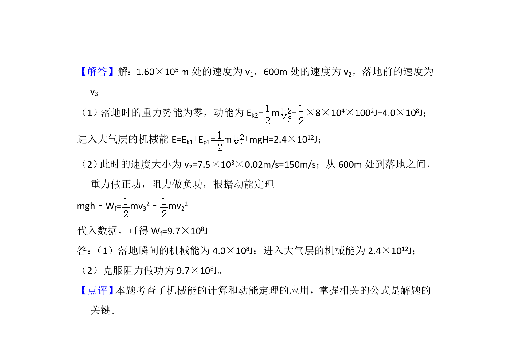

## 题面

## 摘要

飞船返回地面过程中机械能的计算及利用动能定理求克服阻力做功

## 关联考点

- [[251-动能定理|动能定理]]
- [[085-机械能守恒-初中|机械能守恒定律]]
- [[249-功能关系|功能关系]]

## 答案与解析

> 📄 原 PDF 第 12 页：`素材/真题/湖南/2008-2024·（湖南）物理高考真题/2017年高考物理试卷（新课标Ⅰ）（解析卷）.pdf`

<!-- 题干文本-start -->
## 题干文本
11． （12分）一质量为8.00×104kg的太空飞船从其飞行轨道返回地面。飞船在
离地面高度1.60×10 5m处以7.5×10 3m/s的速度进入大气层，逐渐减慢至速
度为100m/s时下落到地面。取地面为重力势能零点，在飞船下落过程中，重
力加速度可视为常量，大小取为9.8m/s 2． （结果保留2位有效数字）
（1）分别求出该飞船着地前瞬间的机械能和它进入大气层时的机械能；
（2）求飞船从离地面高度600m处至着地前瞬间的过程中克服阻力所做的功，
已知飞船在该处的速度大小是其进入大气层时速度大小的2.0%。
<!-- 题干文本-end -->

<!-- 解析文本-start -->
## 解析文本
【考点】65：动能定理；6C：机械能守恒定律．菁优网版权所有
【专题】32：定量思想；43：推理法．
【分析】 （1）机械能等于重力势能和动能之和，可以得出两处的机械能；
（2）根据动能定理计算克服阻力做功。
<!-- 解析文本-end -->
