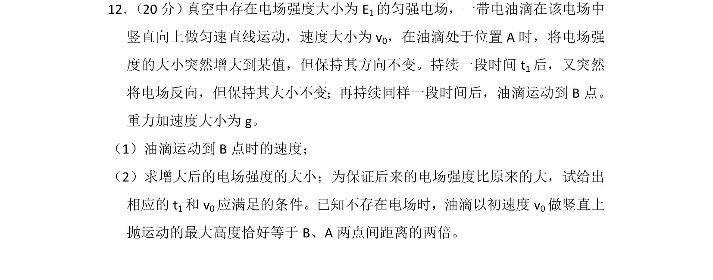
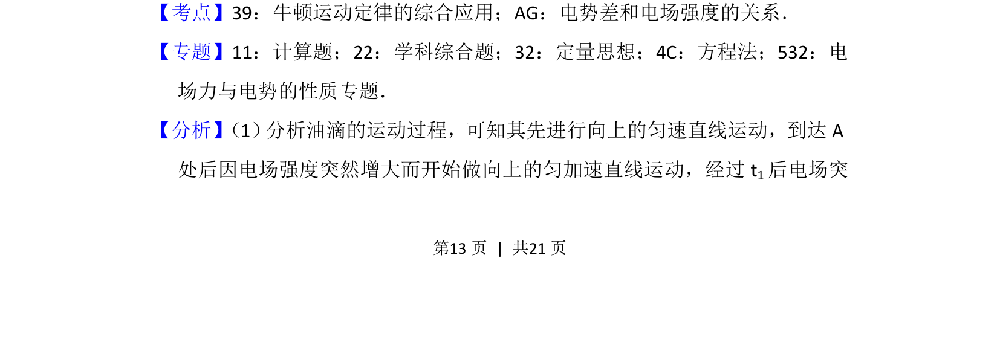
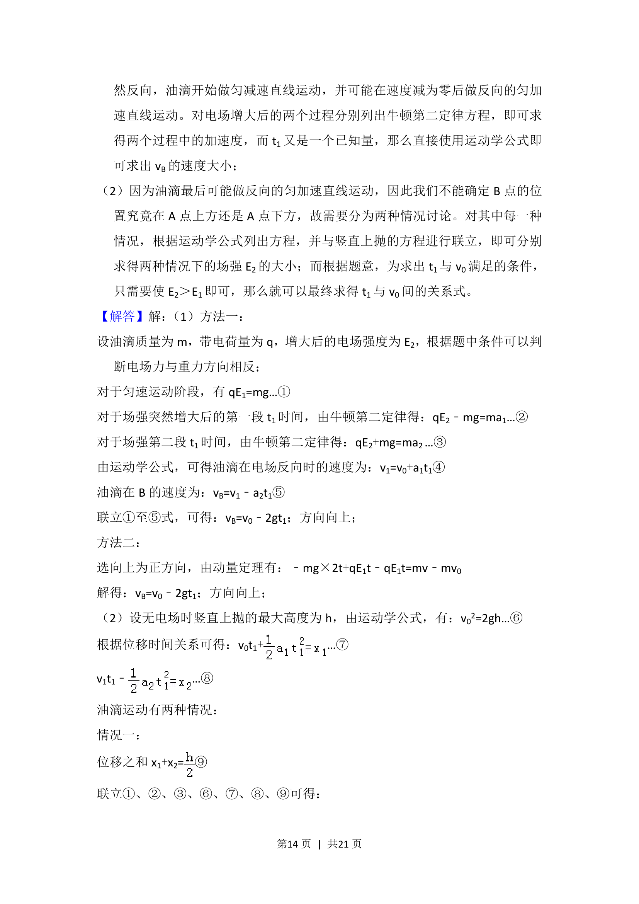
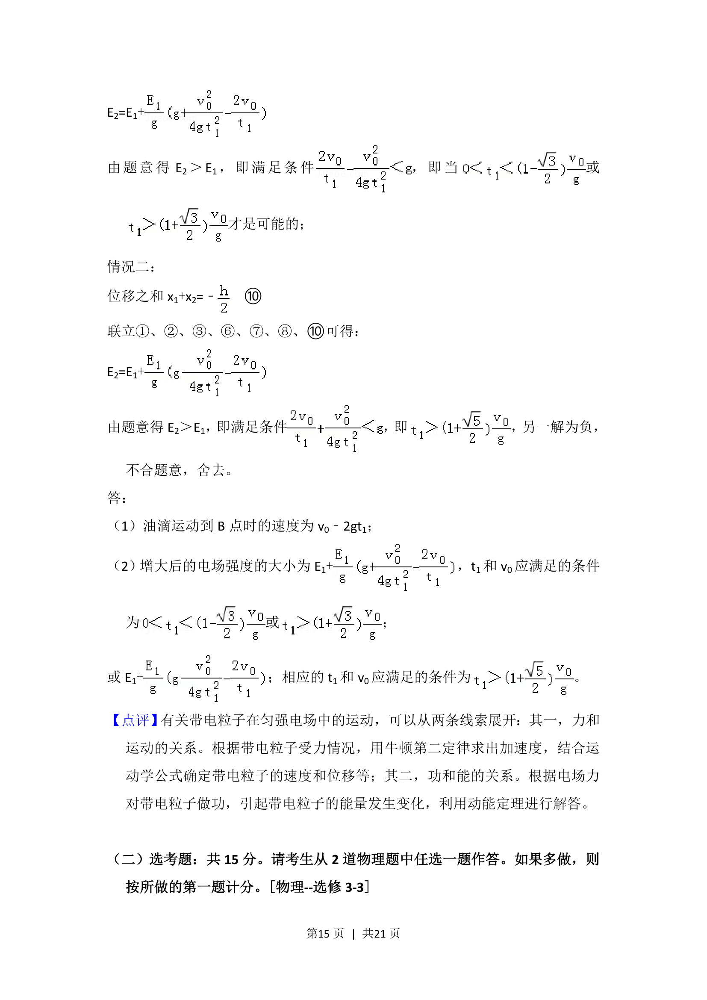

## 题面

## 摘要

带电油滴在电场和重力场中经历匀速、匀加速、匀减速多阶段运动，涉及电场强度变化与反向。

## 关联考点

- [[牛顿运动定律的综合应用]]
- [[电势差和电场强度的关系]]

## 答案与解析

> 📄 原 PDF 第 13 页：`素材/真题/湖南/2008-2024·（湖南）物理高考真题/2017年高考物理试卷（新课标Ⅰ）（解析卷）.pdf`

<!-- 题干文本-start -->
## 题干文本
12． （20分） 真空中存在电场强度大小为E1的匀强电场，一带电油滴在该电场中
竖直向上做匀速直线运动，速度大小为v 0，在油滴处于位置A时，将电场强
度的大小突然增大到某值，但保持其方向不变。持续一段时间t 1后，又突然
将电场反向，但保持其大小不变；再持续同样一段时间后，油滴运动到B点。
重力加速度大小为g。
（1）油滴运动到B点时的速度；
（2）求增大后的电场强度的大小；为保证后来的电场强度比原来的大，试给出
相应的t 1和v 0应满足的条件。已知不存在电场时，油滴以初速度v0做竖直上
抛运动的最大高度恰好等于B、A两点间距离的两倍。
<!-- 题干文本-end -->

<!-- 解析文本-start -->
## 解析文本
【考点】39：牛顿运动定律的综合应用；AG：电势差和电场强度的关系．菁优网版权所有
【专题】11：计算题；22：学科综合题；32：定量思想；4C：方程法；532：电
场力与电势的性质专题．
【分析】 （1） 分析油滴的运动过程，可知其先进行向上的匀速直线运动，到达A
处后因电场强度突然增大而开始做向上的匀加速直线运动，经过t 1后电场突
<!-- 解析文本-end -->
