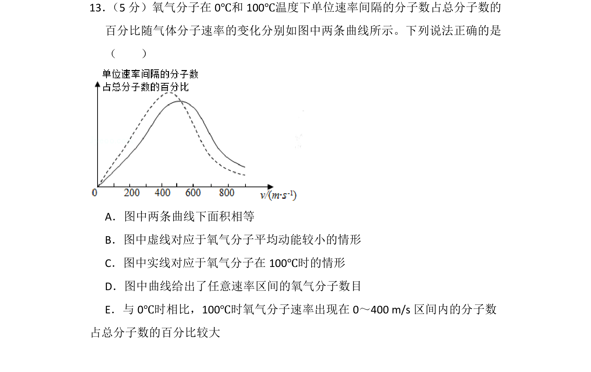
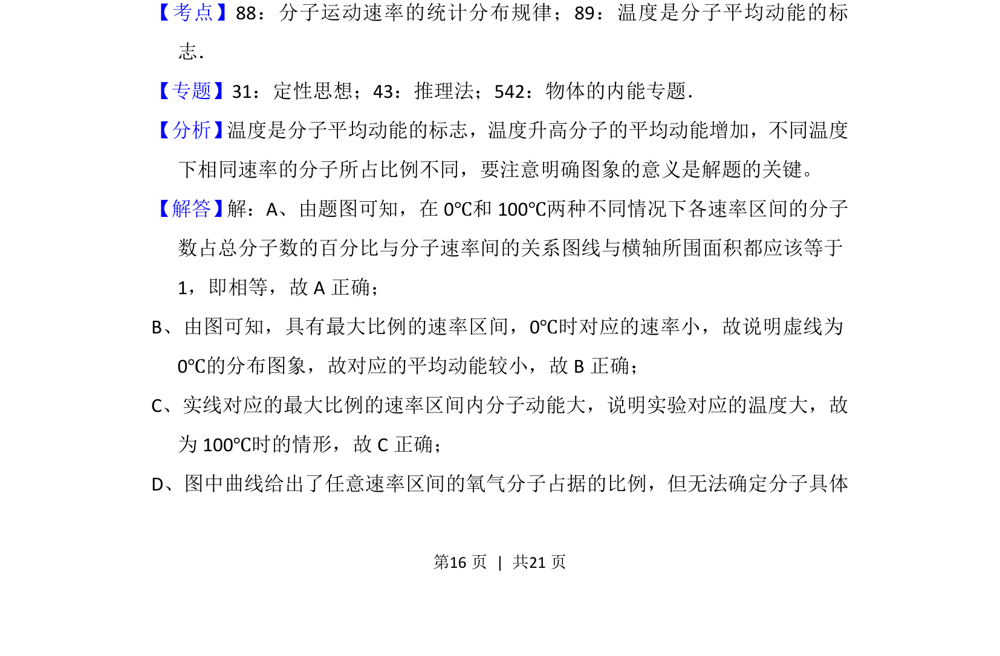
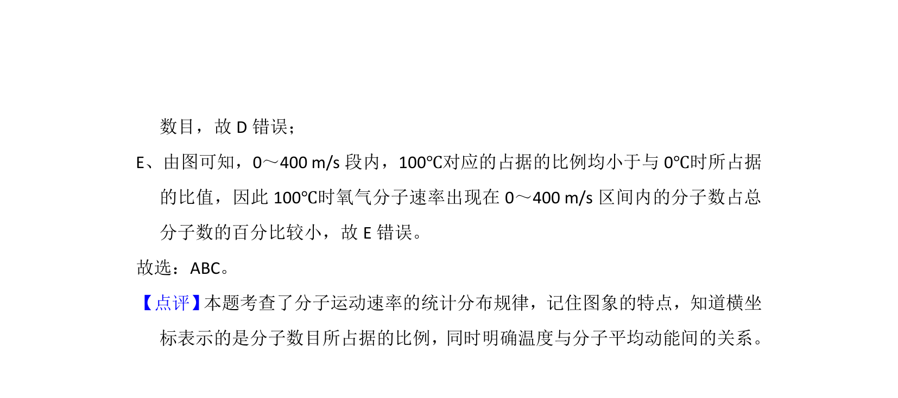

## 题面

## 摘要

氧气分子速率分布曲线与温度的关系，考查分子平均动能及曲线下面积含义

## 关联考点

- [[分子运动速率的统计分布规律]]
- [[温度是分子平均动能的标志]]

## 答案与解析

> 📄 原 PDF 第 16 页：`素材/真题/湖南/2008-2024·（湖南）物理高考真题/2017年高考物理试卷（新课标Ⅰ）（解析卷）.pdf`

<!-- 题干文本-start -->
## 题干文本
13． （5分）氧气分子在0℃和100℃温度下单位速率间隔的分子数占总分子数的
百分比随气体分子速率的变化分别如图中两条曲线所示。下列说法正确的是
（　　）
A．图中两条曲线下面积相等
B．图中虚线对应于氧气分子平均动能较小的情形
C．图中实线对应于氧气分子在100℃时的情形
D．图中曲线给出了任意速率区间的氧气分子数目
E．与0℃时相比，100℃时氧气分子速率出现在0～400 m/s区间内的分子数
占总分子数的百分比较大
<!-- 题干文本-end -->

<!-- 解析文本-start -->
## 解析文本
【考点】88：分子运动速率的统计分布规律；89：温度是分子平均动能的标
志．菁优网版权所有
【专题】31：定性思想；43：推理法；542：物体的内能专题．
【分析】 温度是分子平均动能的标志，温度升高分子的平均动能增加，不同温度
下相同速率的分子所占比例不同，要注意明确图象的意义是解题的关键。
【解答】 解：A、由题图可知，在0℃和100℃两种不同情况下各速率区间的分子
数占总分子数的百分比与分子速率间的关系图线与横轴所围面积都应该等于
1，即相等，故A正确；
B、由图可知，具有最大比例的速率区间，0℃时对应的速率小，故说明虚线为
0℃的分布图象，故对应的平均动能较小，故B正确；
C、实线对应的最大比例的速率区间内分子动能大，说明实验对应的温度大，故
为100℃时的情形，故C正确；
D、图中曲线给出了任意速率区间的氧气分子占据的比例，但无法确定分子具体
<!-- 解析文本-end -->
