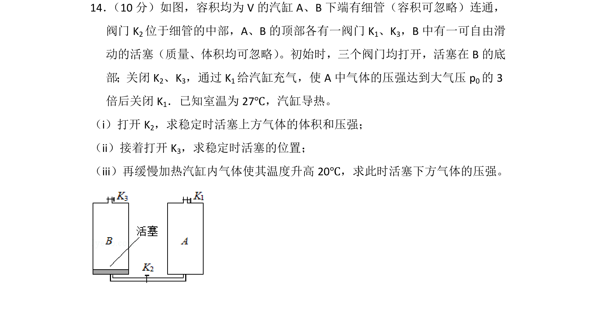
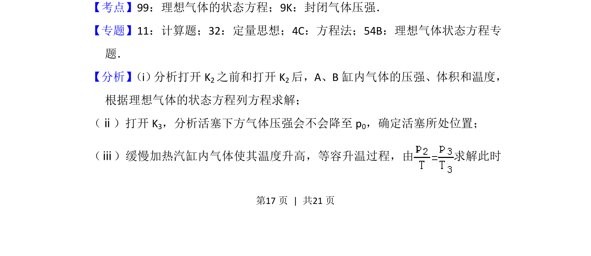
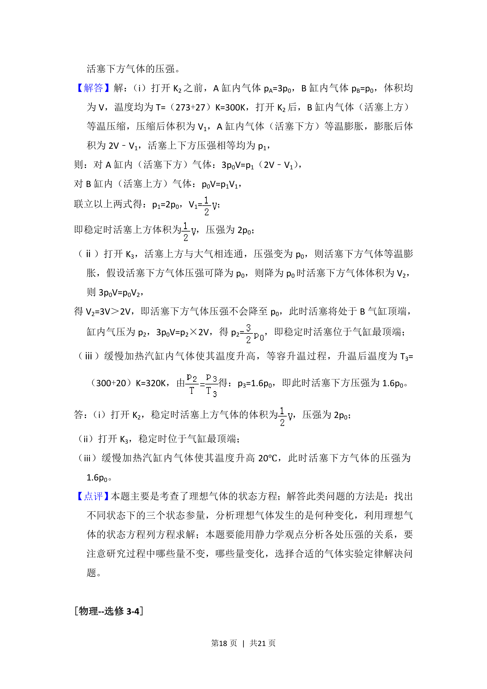

## 题面

## 摘要

打开K2、K3及加热过程分析汽缸内封闭气体的状态变化，求体积与压强

## 关联考点

- [[446-理想气体状态方程|理想气体的状态方程]]
- [[591-封闭气体压强|封闭气体压强]]

## 答案与解析

> 📄 原 PDF 第 17 页：`素材/真题/湖南/2008-2024·（湖南）物理高考真题/2017年高考物理试卷（新课标Ⅰ）（解析卷）.pdf`

<!-- 题干文本-start -->
## 题干文本
14． （10分）如图，容积均为V的汽缸A、B下端有细管（容积可忽略）连通，
阀门K 2位于细管的中部，A、B的顶部各有一阀门K 1、K3，B中有一可自由滑
动的活塞（质量、体积均可忽略） 。初始时，三个阀门均打开，活塞在B的底
部；关闭K2、K3，通过K 1给汽缸充气，使A中气体的压强达到大气压p 0的3
倍后关闭K 1．已知室温为27℃，汽缸导热。
（i）打开K 2，求稳定时活塞上方气体的体积和压强；
（ii）接着打开K 3，求稳定时活塞的位置；
（iii）再缓慢加热汽缸内气体使其温度升高20℃，求此时活塞下方气体的压强。
<!-- 题干文本-end -->

<!-- 解析文本-start -->
## 解析文本
【考点】99：理想气体的状态方程；9K：封闭气体压强．菁优网版权所有
【专题】11：计算题；32：定量思想；4C：方程法；54B：理想气体状态方程专
题．
【分析】 （i） 分析打开K2之前和打开K 2后，A、B缸内气体的压强、体积和温度，
根据理想气体的状态方程列方程求解；
（ⅱ）打开K 3，分析活塞下方气体压强会不会降至p 0，确定活塞所处位置；
（ⅲ）缓慢加热汽缸内气体使其温度升高，等容升温过程，由 求解此时
<!-- 解析文本-end -->
