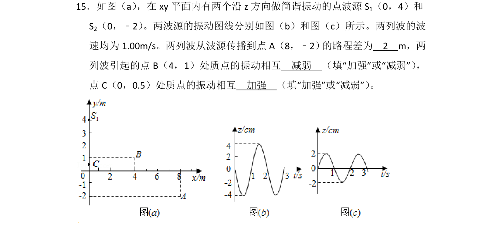
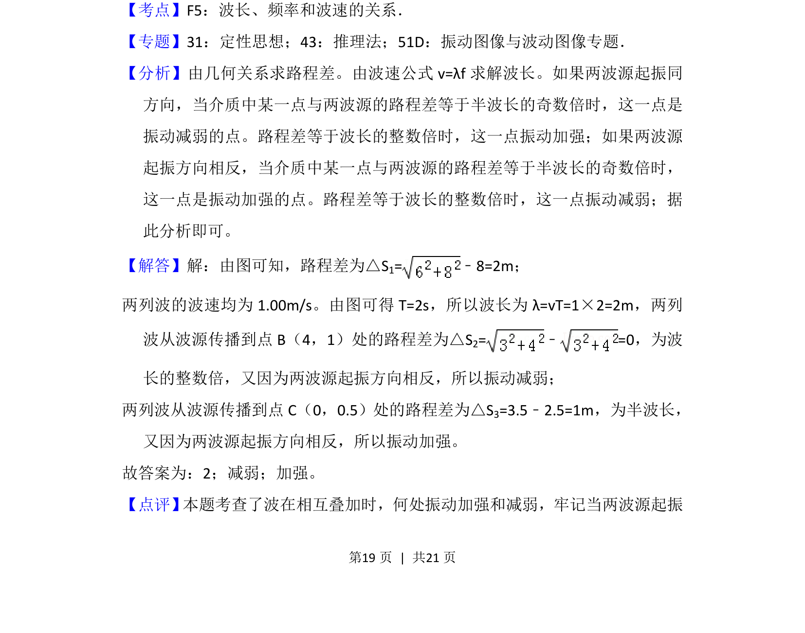

## 题面

## 摘要

考查两列机械波的干涉现象，通过波程差和波源振动方向判断质点振动加强或减弱。

## 关联考点

- [[机械波的干涉]]
- [[波程差]]
- [[振动加强减弱条件]]

## 答案与解析

> 📄 原 PDF 第 19 页：`素材/真题/湖南/2008-2024·（湖南）物理高考真题/2017年高考物理试卷（新课标Ⅰ）（解析卷）.pdf`

<!-- 题干文本-start -->
## 题干文本
15．如图（a） ，在xy平面内有两个沿z方向做简谐振动的点波源S 1（0，4）和
S2（0，﹣2） 。两波源的振动图线分别如图（b）和图（c）所示。两列波的波
速均为1.00m/s。两列波从波源传播到点A（8，﹣2） 的路程差为　2　m，两
列波引起的点B（4，1）处质点的振动相互　减弱　（填“加强”或“减弱”） ，
点C（0，0.5）处质点的振动相互　加强　（填“加强”或“减弱”） 。
<!-- 题干文本-end -->

<!-- 解析文本-start -->
## 解析文本
【考点】F5：波长、频率和波速的关系．菁优网版权所有
【专题】31：定性思想；43：推理法；51D：振动图像与波动图像专题．
【分析】由几何关系求路程差。由波速公式v=λf求解波长。如果两波源起振同
方向，当介质中某一点与两波源的路程差等于半波长的奇数倍时，这一点是
振动减弱的点。路程差等于波长的整数倍时，这一点振动加强；如果两波源
起振方向相反，当介质中某一点与两波源的路程差等于半波长的奇数倍时，
这一点是振动加强的点。路程差等于波长的整数倍时，这一点振动减弱；据
此分析即可。
【解答】解：由图可知，路程差为△S1=﹣8=2m；
两列波的波速均为1.00m/s。由图可得T=2s，所以波长为λ=vT=1×2=2m，两列
波从波源传播到点B（4，1）处的路程差为△S 2=﹣=0，为波
长的整数倍，又因为两波源起振方向相反，所以振动减弱；
两列波从波源传播到点C（0，0.5）处的路程差为△S 3=3.5﹣2.5=1m，为半波长，
又因为两波源起振方向相反，所以振动加强。
故答案为：2；减弱；加强。
【点评】 本题考查了波在相互叠加时，何处振动加强和减弱，牢记当两波源起振
<!-- 解析文本-end -->
