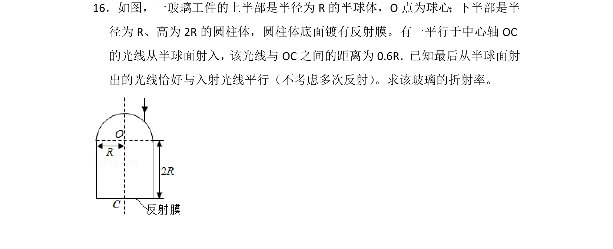
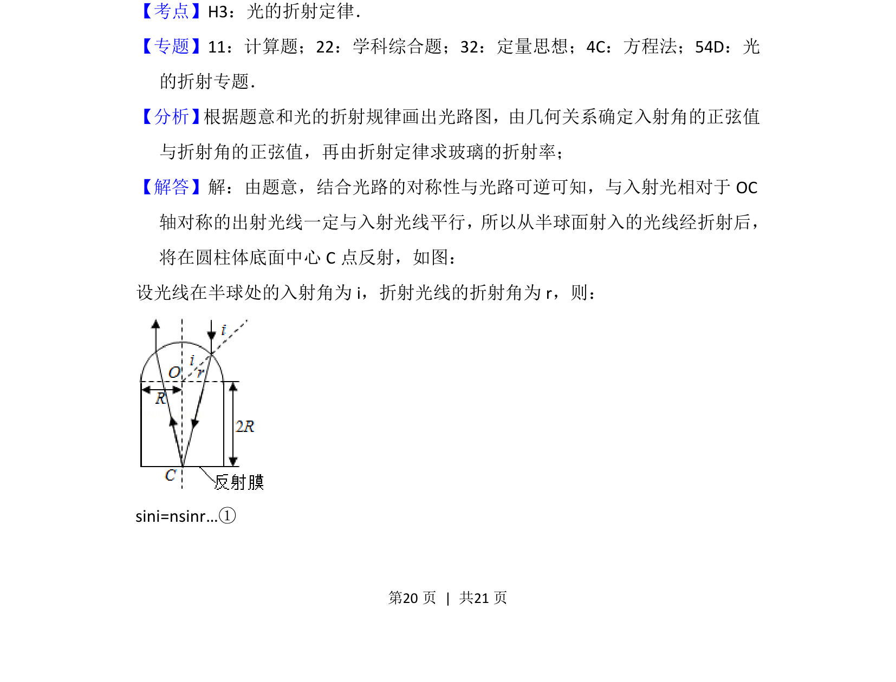
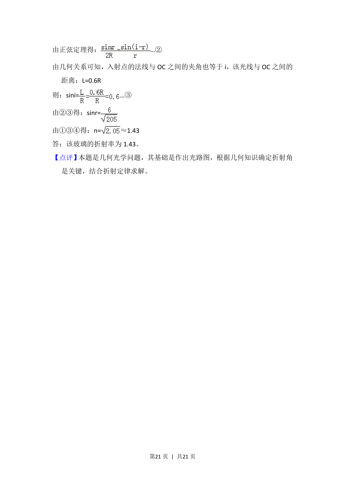

## 题面

## 摘要

光线经半球折射、圆柱底面反射再折射出射，运用折射定律与几何关系求折射率。

## 关联考点

- [[520-光的折射定律|光的折射定律]]
- [[光路对称与可逆]]
- [[455-几何光学|几何光学]]

## 答案与解析

> 📄 原 PDF 第 20 页：`素材/真题/湖南/2008-2024·（湖南）物理高考真题/2017年高考物理试卷（新课标Ⅰ）（解析卷）.pdf`
