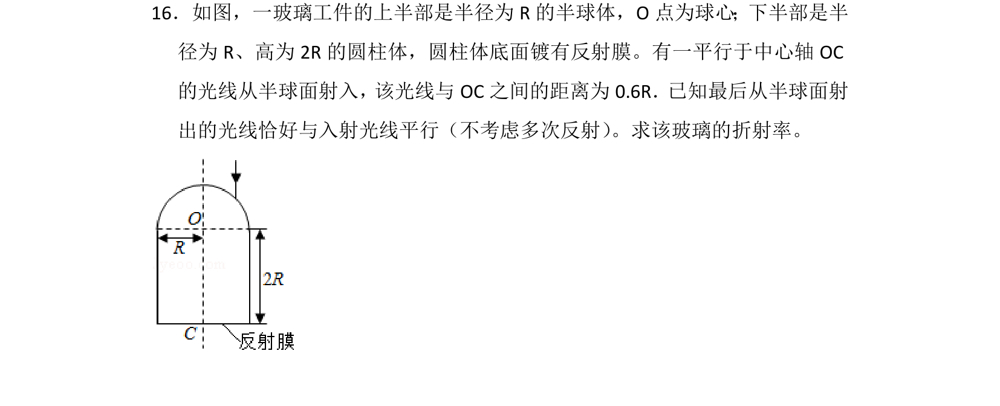
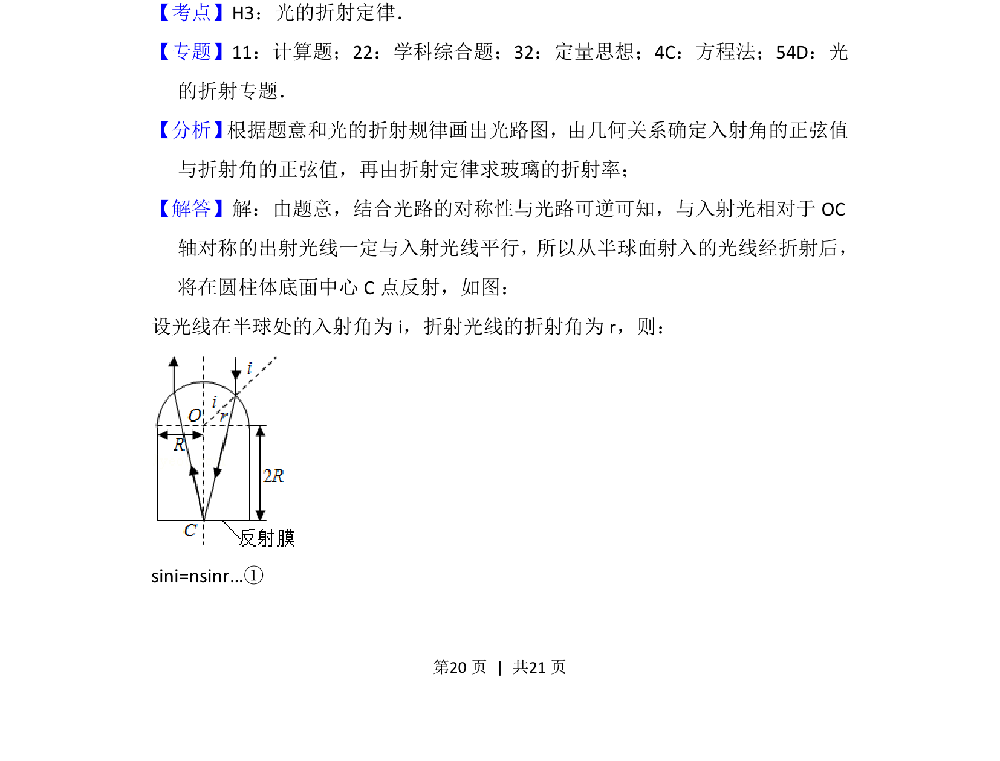
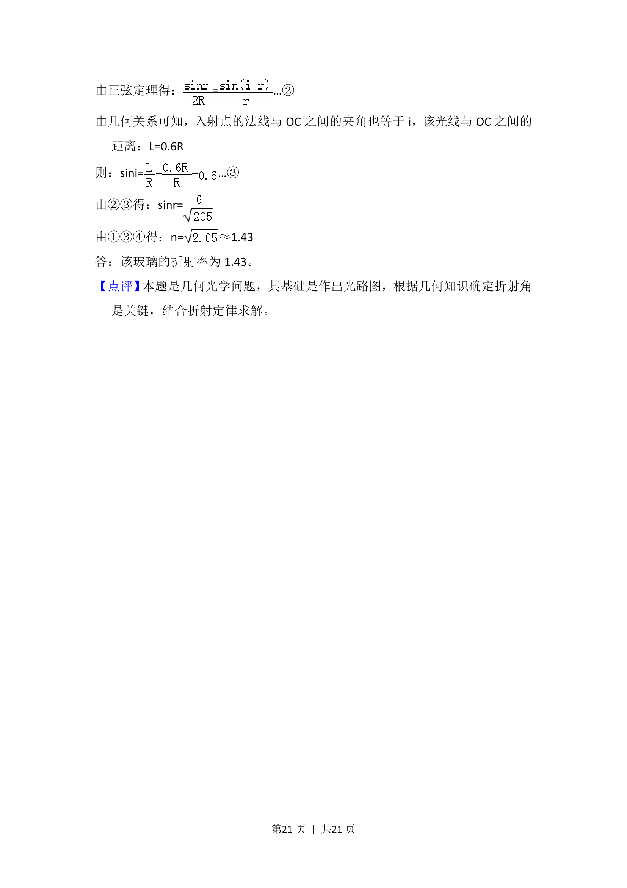

## 题面

## 摘要

光线经半球折射、圆柱底面反射再折射出射，运用折射定律与几何关系求折射率。

## 关联考点

- [[520-光的折射定律|光的折射定律]]
- [[光路对称与可逆]]
- [[455-几何光学|几何光学]]

## 答案与解析

> 📄 原 PDF 第 20 页：`素材/真题/湖南/2008-2024·（湖南）物理高考真题/2017年高考物理试卷（新课标Ⅰ）（解析卷）.pdf`

<!-- 题干文本-start -->
## 题干文本
16．如图，一玻璃工件的上半部是半径为R的半球体，O点为球心；下半部是半
径为R、高为2R的圆柱体，圆柱体底面镀有反射膜。有一平行于中心轴OC
的光线从半球面射入，该光线与OC之间的距离为0.6R．已知最后从半球面射
出的光线恰好与入射光线平行（不考虑多次反射） 。求该玻璃的折射率。
<!-- 题干文本-end -->

<!-- 解析文本-start -->
## 解析文本
【考点】H3：光的折射定律．菁优网版权所有
【专题】11：计算题；22：学科综合题；32：定量思想；4C：方程法；54D：光
的折射专题．
【分析】 根据题意和光的折射规律画出光路图，由几何关系确定入射角的正弦值
与折射角的正弦值，再由折射定律求玻璃的折射率；
【解答】解：由题意，结合光路的对称性与光路可逆可知，与入射光相对于OC
轴对称的出射光线一定与入射光线平行，所以从半球面射入的光线经折射后，
将在圆柱体底面中心C点反射，如图：
设光线在半球处的入射角为i，折射光线的折射角为r，则：
sini=nsinr…①
<!-- 解析文本-end -->
