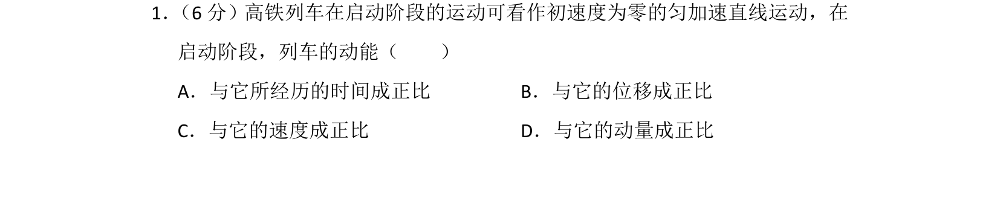
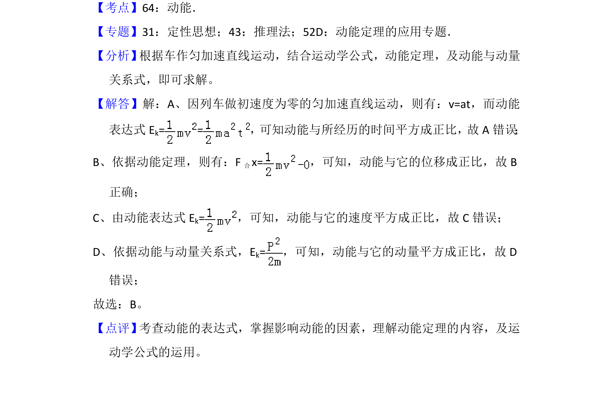

## 题面

## 摘要

高铁列车匀加速启动阶段，动能与位移成正比，与时间平方、速度平方、动量平方成正比。

## 关联考点

- [[067-动能|动能]]
- [[215-匀变速直线运动|匀变速直线运动]]
- [[251-动能定理|动能定理]]

## 答案与解析

> 📄 原 PDF 第 1 页：`素材/真题/湖南/2008-2024·（湖南）物理高考真题/2018年高考物理试卷（新课标Ⅰ）（解析卷）.pdf`
